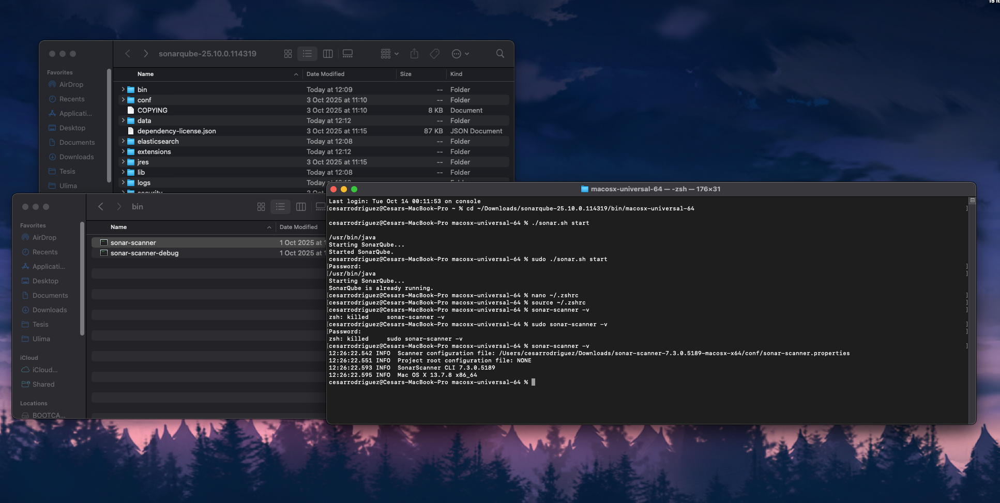
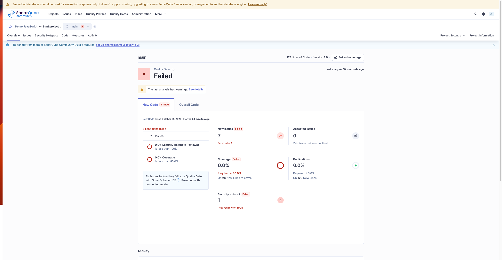
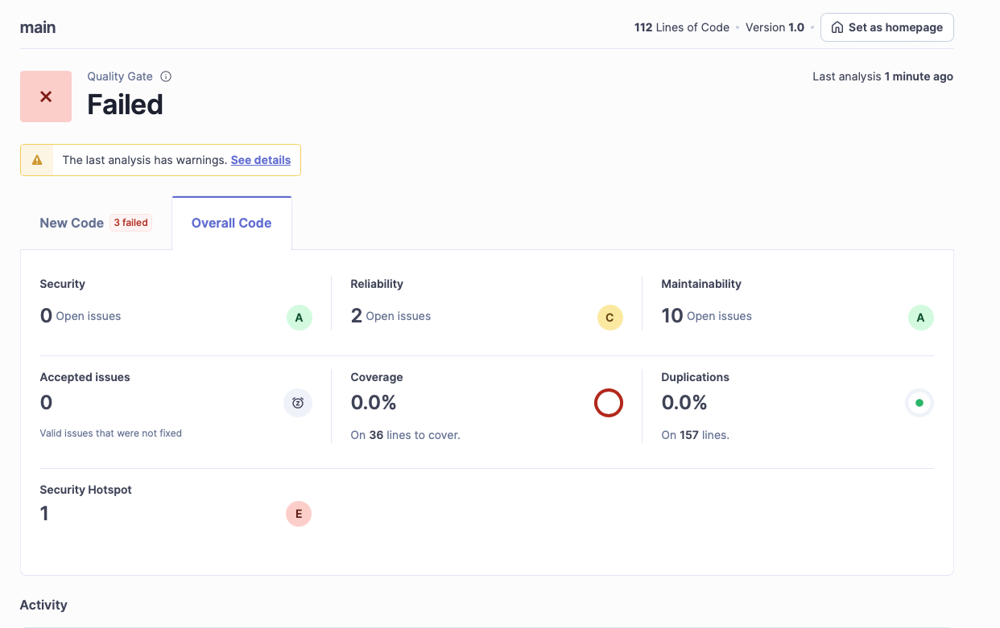
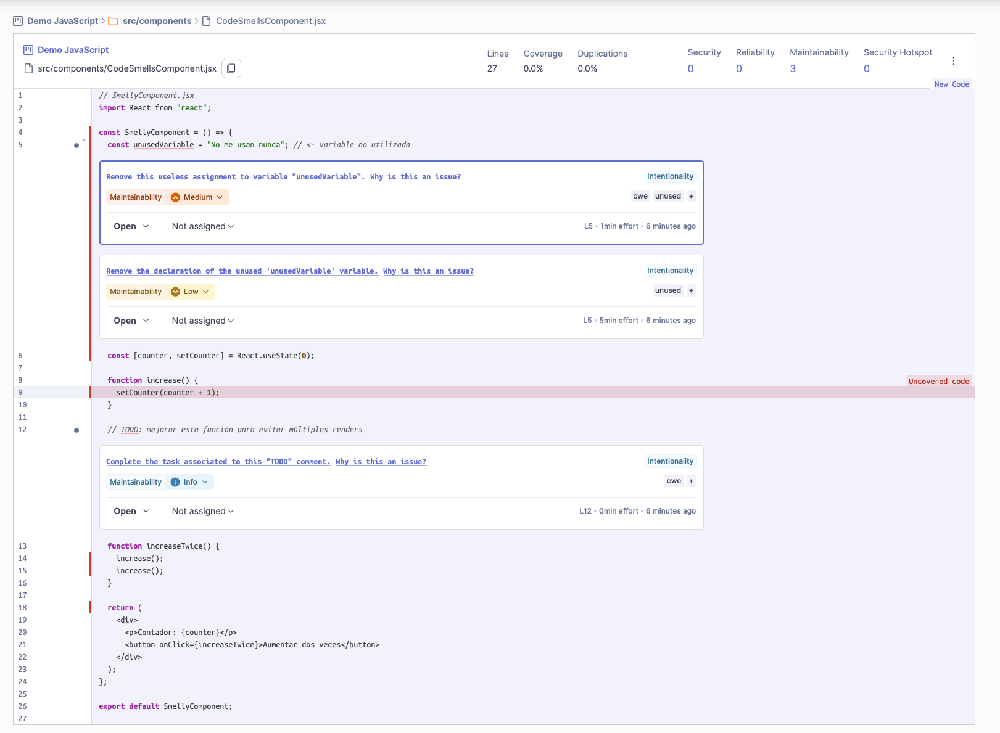
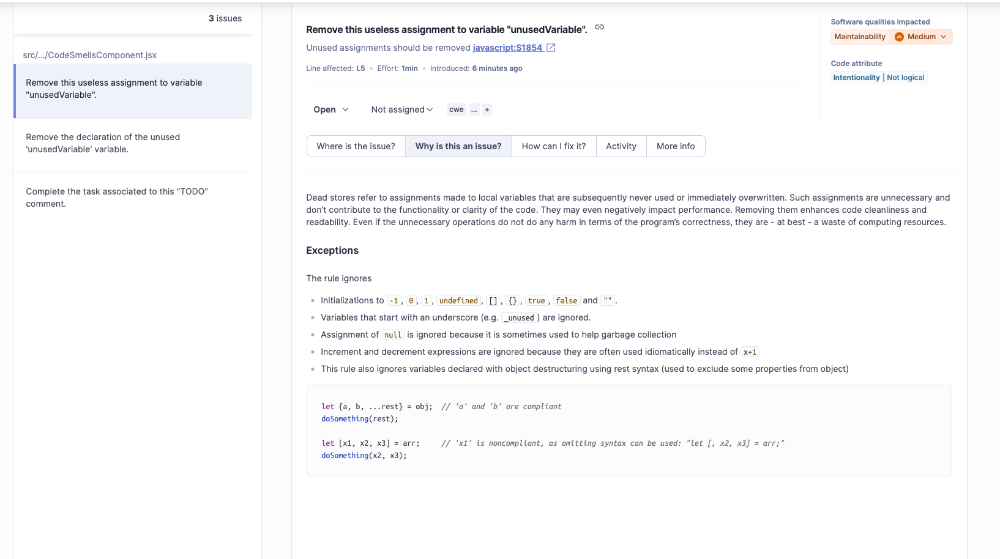

> [0. Acerca del Grupo](../../0.md) › [0.6. Temas Individuales (Parte 1)](../0.6.md) › [0.6.2. Integrante 2](0.6.2.md)

# 0.6.2. Integrante 2

Análisis Estático de Código: SonarQube

---
## Análisis Estático de Código

La calidad del software es un aspecto esencial en el ciclo de vida del desarrollo, ya que influye directamente en la mantenibilidad, seguridad, confiabilidad y rendimiento de los sistemas. En entornos de desarrollo colaborativo, donde múltiples desarrolladores trabajan de forma paralela, resulta fundamental contar con mecanismos que permitan detectar errores, vulnerabilidades o malas prácticas de programación de manera temprana.

Dentro de las estrategias utilizadas para asegurar la calidad del software, el análisis estático de código consiste en examinar el código fuente sin necesidad de ejecutarlo, identificando posibles defectos o incumplimientos de estándares antes de que lleguen a producción. Las características que se suelen considerar para evaluar la calidad del software son la confiabilidad, seguridad, mantenibilidad, portabilidad y eficiencia del desempeño, siendo la mantenibilidad la más importante en proyectos desarrollados en equipo, ya que mide la facilidad con la que el código puede ser mejorado, corregido o modificado.

Beneficios del análisis estático:

- Detección temprana de errores y vulnerabilidades.
- Mejora de la mantenibilidad del código.
- Reducción de la deuda técnica.
- Facilita la adopción de estándares de codificación.
- Integración con pipelines de integración continua (CI/CD).

---

### Métricas de calidad del código

Las herramientas de análisis estático se apoyan en diferentes métricas para evaluar la calidad del código. A continuación, se presentan algunas de las más utilizadas:

| **Métrica**                 | **Descripción**                                                    | **Propósito principal**                                            |
| --------------------------- | ------------------------------------------------------------------ | ------------------------------------------------------------------ |
| **Complejidad ciclomática** | Mide el número de caminos independientes en el flujo del programa. | Evaluar la mantenibilidad y detectar módulos con alta complejidad. |
| **Duplicación de código**   | Detecta fragmentos repetidos en diferentes partes del código.      | Promover la reutilización y reducir el tamaño del código.          |
| **Code Smells**             | Identifica patrones de mal diseño o prácticas ineficientes.        | Mejorar la legibilidad y reducir la deuda técnica.                 |
| **Cobertura de pruebas**    | Indica el porcentaje de código cubierto por tests automatizados.   | Aumentar la confiabilidad del software.                            |
| **Vulnerabilidades**        | Señala posibles fallos de seguridad en el código.                  | Fortalecer la seguridad y evitar exploits.                         |

Estas métricas permiten cuantificar aspectos de la calidad interna del software y orientar a los desarrolladores en el proceso de mejora continua.

---

## Herramientas de análisis estático

Existen múltiples herramientas que permiten realizar análisis estático de código, cada una con enfoques, lenguajes y niveles de integración distintos. A continuación, se presenta una comparativa de las herramientas más reconocidas en el ámbito del desarrollo de software.

| **Herramienta**       | **Lenguajes soportados**                        | **Tipo de análisis**                                             | **Integración CI/CD**                               | **Reportes visuales**                                         | **Licencia**              |
| --------------------- | ----------------------------------------------- | ---------------------------------------------------------------- | --------------------------------------------------- | ------------------------------------------------------------- | ------------------------- |
| **SonarQube**         | Java, JavaScript, Python, C#, PHP, entre otros. | Métricas, vulnerabilidades, code smells, duplicación, seguridad. | Sí (Jenkins, GitLab, GitHub Actions, Azure DevOps). | Panel interactivo con indicadores de calidad y deuda técnica. | Open Source / Enterprise. |
| **PMD**               | Java, Apex, PLSQL, XML, XSL.                    | Detección de errores comunes y violaciones de estilo.            | Parcial.                                            | Limitado (reportes en HTML).                                  | Open Source.              |
| **Checkstyle**        | Java.                                           | Validación de convenciones de estilo y formato del código.       | Parcial.                                            | No incluye panel visual.                                      | Open Source.              |
| **ESLint**            | JavaScript, TypeScript.                         | Linter configurable para reglas personalizadas.                  | Sí (ampliamente usado en pipelines web).            | Parcial (plugins visuales).                                   | Open Source.              |
| **FindBugs/SpotBugs** | Java.                                           | Detección de defectos y errores comunes en bytecode.             | Limitado.                                           | Reportes HTML/XML.                                            | Open Source.              |

---

## Selección de la herramienta

Tras el análisis comparativo, se determinó que SonarQube es la herramienta más adecuada para la implementación práctica y para su integración en el proyecto grupal del curso.

Las razones principales para esta elección son:

1. Compatibilidad multilenguaje: SonarQube soporta una amplia variedad de lenguajes de programación (como Java, JavaScript, Python, PHP, y más), lo que lo hace ideal para entornos colaborativos donde se emplean diferentes tecnologías, como en el caso del proyecto web grupal.
    
2. Integración con pipelines CI/CD: Puede integrarse fácilmente con herramientas de integración continua como Jenkins, GitLab CI/CD o GitHub Actions, permitiendo automatizar la revisión de calidad en cada commit o despliegue.
    
3. Panel de control visual: Ofrece un dashboard completo con indicadores clave de calidad, deuda técnica, duplicación y vulnerabilidades, facilitando el seguimiento continuo de la evolución del código.
    
4. Soporte de métricas avanzadas: Permite personalizar reglas de calidad, establecer umbrales y definir “Quality Gates” que bloquean versiones que no cumplen los estándares definidos.

---

## Demo: Implementación del Análisis Estático de Código con SonarQube

Con el objetivo de demostrar la aplicación práctica del análisis estático de código, se realizó una implementación utilizando SonarQube como herramienta principal. El entorno de pruebas se configuró sobre macOS, empleando un proyecto base desarrollado en React y Node.js.

### Configuración del entorno

El entorno de trabajo se configuró en un equipo con macOS, utilizando SonarQube y SonarScanner.  
Los pasos principales fueron los siguientes:

1. Descarga y configuración de SonarQube:  
    Se descargó la versión _Community Edition_ desde el sitio oficial de SonarQube.  
    Luego, se descomprimió el paquete y se ejecutó el servidor con:
    
    `./sonar.sh start`
    
    Una vez iniciado, la interfaz de administración se accedió desde el navegador en la dirección `http://localhost:9000`.
    
1. Instalación del SonarScanner:  
    Se descargó el SonarScanner para macOS, se descomprimió el archivo y se añadió su ruta al PATH del sistema:
    
    `nano ~/.zshrc export PATH=$PATH:~/Downloads/sonar-scanner-7.3.0.5189-macosx-x64/bin`
    
    Finalmente, se verificó la instalación con:
    
    `sonar-scanner -v`
    
1. Configuración del proyecto React–Node.js:  
    Se creó un proyecto base de React y Node.js, añadiendo un archivo `sonar-project.properties` con la siguiente configuración:
    
    `sonar.projectKey=demo_jsx sonar.projectName=Demo React Analysis sonar.sources=src sonar.language=js sonar.host.url=http://localhost:9000 sonar.login=<token-generado>`

---

### Creación del Código de prueba

Para la evaluación se desarrollaron cinco componentes JSX con distintos niveles de calidad de código. Cada componente fue diseñado para provocar tipos de incidencias específicas (bugs, vulnerabilidades, code smells o duplicaciones), con el fin de observar cómo SonarQube clasifica el código según los criterios de fiabilidad, seguridad y mantenibilidad.

| **Archivo**                 | **Propósito**             | **Tipo de Issue detectado** | **Rating esperado** |
| --------------------------- | ------------------------- | --------------------------- | ------------------- |
| `CleanComponent.jsx`        | Código limpio y funcional | Ninguno                     | A                   |
| `CodeSmellsComponent.jsx`   | Malas prácticas leves     | Mantenibilidad              | B–C                 |
| `SecurityRiskComponent.jsx` | Vulnerabilidad deliberada | Seguridad                   | C–D                 |
| `BugComponent.jsx`          | Error lógico              | Bug (fiabilidad)            | D                   |
| `DuplicateComponent.jsx`    | Código repetido           | Mantenibilidad              | C–D                 |

---
### Resultados del análisis de SonarQube

Cada uno de los archivos fue analizado por SonarQube, generando resultados diferenciados según los tipos de problemas detectados. En las siguiente imagenes se muestra el dashboard general del proyecto, donde se observan las métricas globales de fiabilidad (Reliability), seguridad (Security), mantenibilidad (Maintainability), cobertura (Coverage) y duplicación (Duplications).

El resultado del análisis reflejó correctamente las condiciones esperadas de cada archivo:

- CleanComponent.jsx obtuvo un rating A en todas las métricas, evidenciando un código estructurado, seguro y libre de malas prácticas.

- CodeSmellsComponent.jsx presentó advertencias de mantenibilidad por el uso de variables sin emplear y comentarios TODO, lo que redujo su calificación a B/C en Maintainability.

- SecurityRiskComponent.jsx fue identificado con una vulnerabilidad crítica por el uso de la función eval(), práctica considerada insegura en entornos de ejecución web.

- BugComponent.jsx mostró un error lógico en la función findItem, detectado como bug de fiabilidad, generando un rating D en Reliability.

- DuplicateComponent.jsx obtuvo un rating C–D, debido a la duplicación de bloques de código similares, lo que afectó su mantenibilidad.

En la siguientes imagenes se observa un ejemplo del issue report generado por SonarQube, donde se detalla el tipo de problema, su severidad y una breve descripción de la causa detectada.

---

[⬅️ Anterior](../0.6.1/0.6.1.md) | [🏠 Home](../../../README.md) | [Siguiente ➡️](../0.6.3/0.6.3.md)