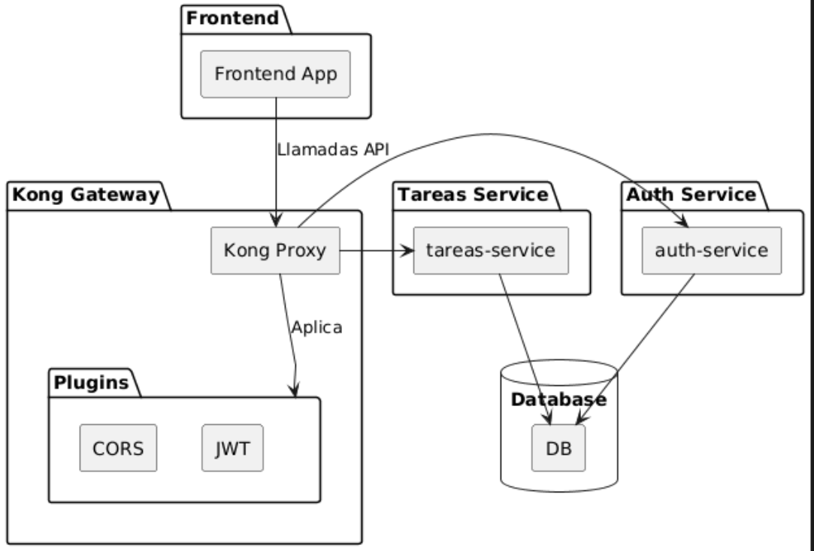

> [0. Acerca del Grupo](../../0.md) › [0.6. Temas Individuales (Parte 1)](../0.6.md) › [0.6.4. Integrante 4](0.6.4.md)

# 0.6.4. Integrante 4
API Management : Monitoreo de uso y rendimiento de APIs

## ¿Qué es API Management?

**API Management** es el conjunto de prácticas, herramientas y políticas que permiten diseñar, publicar, proteger, monitorear y analizar APIs en entornos seguros y escalables. Su objetivo es garantizar la disponibilidad, el rendimiento y la seguridad de las interfaces que conectan distintos servicios o aplicaciones.

### Funciones Principales

1. **Control de acceso y autenticación de usuarios:** Gestión de permisos y credenciales para acceder a las APIs
2. **Monitoreo del uso y rendimiento de las APIs:** Recolección de métricas y análisis del comportamiento
3. **Versionamiento y documentación centralizada:** Gestión de múltiples versiones y documentación automática
4. **Aplicación de políticas de seguridad y cuotas de uso:** Rate limiting, throttling y políticas de acceso

---

## Componentes de API Management para Monitoreo

### 1. API Gateway
Punto de entrada central que gestiona, canaliza y controla las peticiones hacia las APIs. Permite aplicar políticas de seguridad, autenticar clientes y recopilar métricas de tráfico y rendimiento.

**Funciones clave:**
- Enrutamiento de peticiones
- Autenticación y autorización
- Rate limiting y throttling
- Transformación de requests/responses
- Caché de respuestas

### 2. Analytics / Observabilidad
Módulo encargado de recolectar, procesar y visualizar datos de uso, latencia, errores y consumo de recursos. Facilita la generación de reportes y paneles en tiempo real para el análisis del desempeño.

**Métricas recolectadas:**
- Throughput (requests por segundo)
- Latencias (P50, P95, P99)
- Tasa de errores
- Consumo por cliente

### 3. Logging y Tracing
Componentes que registran el detalle de cada solicitud y respuesta, permitiendo rastrear el flujo de las peticiones y detectar fallos o cuellos de botella. Son esenciales para el diagnóstico y la auditoría de los servicios.

**Capacidades:**
- Correlación de peticiones distribuidas
- Trazabilidad end-to-end
- Análisis de causa raíz
- Auditoría de seguridad

---

## Importancia del Monitoreo

El monitoreo en API Management es fundamental para:

 **Detectar fallos o degradación del servicio** antes de que impacten al usuario  
 **Optimizar el rendimiento** mediante el análisis de latencia y tráfico  
 **Asegurar la disponibilidad** y el cumplimiento de acuerdos de nivel de servicio   
 **Evaluar el consumo** por cliente o aplicación, facilitando la toma de decisiones sobre escalabilidad o costos  
 **Identificar patrones de uso** para mejorar el diseño de las APIs  
 **Garantizar la seguridad** mediante detección de comportamientos anómalos

---

## Métricas Clave en el Monitoreo de APIs

| Métrica | Descripción | Uso |
|---------|-------------|-----|
| **Throughput (Rendimiento)** | Número de solicitudes procesadas por segundo | Determinar la capacidad y carga del sistema |
| **Latencia Promedio** | Tiempo total de respuesta desde que se recibe una solicitud hasta que se entrega la respuesta | Identificar cuellos de botella en el procesamiento |
| **Tasa de Éxito y Error** | Porcentaje de solicitudes exitosas (2xx) frente a las que retornan códigos de error (4xx o 5xx) | Evaluar la estabilidad y confiabilidad de las APIs |
| **Consumo por Cliente/Servicio** | Cantidad de solicitudes generadas por cada consumidor, aplicación o credencial de API Key | Análisis de uso y planificación de capacidad |
| **Latencia Interna del Servicio** | Tiempo que el servicio backend tarda en procesar la solicitud después de pasar por el Gateway | Identificar si los retrasos se originan en el backend o en el proxy |

---

## Implementación de API Management en la Nube

### Kong Cloud (Kong Konnect)
Es una plataforma de gestión de APIs basada en la nube que permite administrar, proteger y monitorear servicios de forma centralizada. Kong Cloud actúa como un **API Gateway gestionado**, proporcionando herramientas de observabilidad, autenticación, control de tráfico y análisis de rendimiento.

**Características principales:**
- API Gateway de alto rendimiento basado en NGINX
- Plugins extensibles para autenticación, seguridad y transformación
- Analytics en tiempo real
- Control de tráfico y rate limiting
- Multi-cloud y híbrido

### Otras Plataformas de API Management

| Plataforma | Proveedor | Características Clave |
|------------|-----------|----------------------|
| **Apigee** | Google Cloud | Analytics avanzados, gestión de desarrolladores, monetización de APIs |
| **AWS API Gateway** | Amazon Web Services | Integración nativa con servicios AWS, escalado automático, bajo costo |
| **Azure API Management** | Microsoft Azure | Integración con Azure Active Directory, políticas personalizables, portal de desarrolladores |
| **MuleSoft Anypoint** | Salesforce | Plataforma de integración completa, diseño API-first, gobernanza centralizada |

---



---


### Arquitectura de la Demo

La aplicación está compuesta por tres componentes principales desplegados como microservicios:

1. **AutenticacionService (Auth Service)** - Puerto 3000
   - Servicio de autenticación de usuarios
   - Gestión de registro, login y tokens JWT
   - Conexión a base de datos PostgreSQL compartida

2. **TareaService (Tareas Service)** - Puerto 3001
   - Servicio de gestión de tareas
   - Operaciones CRUD sobre tareas
   - Protegido con middleware de autenticación JWT
   - Conexión a base de datos PostgreSQL compartida

3. **Frontend** - Puerto 80
   - Aplicación React con Vite
   - Interfaz de usuario para registro, login y gestión de tareas
   - Servido con Nginx

4. **Kong Gateway**
   - API Gateway que actúa como punto de entrada único
   - Gestión de plugins (CORS, JWT)
   - Enrutamiento hacia los microservicios

5. **Base de Datos PostgreSQL**
   - Base de datos única compartida por ambos servicios backend
   - Almacena información de usuarios y tareas

---

## Construcción y Despliegue en Azure Container Apps

Esta sección detalla el proceso completo para construir las imágenes Docker de cada microservicio, subirlas a Docker Hub y desplegarlas en Azure Container Apps.

### Prerequisitos

Antes de comenzar, asegúrate de tener instalado:

- [Docker Desktop](https://www.docker.com/products/docker-desktop/) 
- [Azure CLI](https://docs.microsoft.com/cli/azure/install-azure-cli)
- Cuenta en [Docker Hub](https://hub.docker.com/)
- Suscripción activa de Azure

### Paso 1: Preparación del Entorno

#### 1.1. Iniciar sesión en Docker Hub

```bash
docker login
```

Ingresa tu usuario y contraseña de Docker Hub cuando se te solicite.

#### 1.2. Iniciar sesión en Azure

```bash
az login
```

Esto abrirá tu navegador para autenticarte. Selecciona tu suscripción:

```bash
az account set --subscription "<SUBSCRIPTION_ID>"
```

---

### Paso 2: Construcción de Imágenes Docker

#### 2.1. Construir imagen del Servicio de Autenticación

Navega al directorio del servicio de autenticación:

```bash
cd AutenticacionService
```

Construye la imagen Docker:

```bash
docker build -t <tu-usuario-dockerhub>/auth-service:latest .
```

**Explicación del Dockerfile:**

```dockerfile
FROM node:18-alpine          # Imagen base ligera de Node.js
WORKDIR /app                 # Directorio de trabajo
COPY package*.json ./        # Copiar archivos de dependencias
RUN npm install --production # Instalar solo dependencias de producción
COPY . .                     # Copiar código fuente
EXPOSE 3000                  # Exponer puerto 3000
CMD ["npm", "start"]         # Comando de inicio
```


#### 2.2. Construir imagen del Servicio de Tareas

Navega al directorio del servicio de tareas:

```bash
cd ../TareaService
```

Construye la imagen Docker:

```bash
docker build -t <tu-usuario-dockerhub>/tareas-service:latest .
```

**Explicación del Dockerfile:**

```dockerfile
# Etapa 1: Build
FROM node:18-alpine AS builder
WORKDIR /app
COPY package*.json ./
RUN npm ci --only=production  # Instalación limpia y rápida

# Etapa 2: Producción
FROM node:18-alpine
WORKDIR /app
COPY --from=builder /app/node_modules ./node_modules  # Copiar solo node_modules
COPY . .
EXPOSE 3001
ENV NODE_ENV=production
ENV PORT=3001
CMD ["node", "src/server.js"]
```


#### 2.3. Construir imagen del Frontend

Navega al directorio del frontend:

```bash
cd ../frontend
```

Construye la imagen Docker:

```bash
docker build -t <tu-usuario-dockerhub>/frontend:latest .
```

**Explicación del Dockerfile:**

```dockerfile
# Etapa 1: Build de la aplicación React
FROM node:18-alpine AS build
WORKDIR /app
COPY package*.json ./
RUN npm install
COPY . .
RUN npm run build                # Genera build optimizado de producción

# Etapa 2: Servir con Nginx
FROM nginx:alpine                # Servidor web ligero
COPY --from=build /app/dist /usr/share/nginx/html  # Copiar archivos estáticos
COPY nginx.conf /etc/nginx/conf.d/default.conf     # Configuración personalizada
EXPOSE 80
CMD ["nginx", "-g", "daemon off;"]
```


---

### Paso 3: Subir Imágenes a Docker Hub

Una vez construidas todas las imágenes, súbelas a Docker Hub:

#### 3.1. Subir imagen de Autenticación

```bash
docker push <tu-usuario-dockerhub>/auth-service:latest
```

#### 3.2. Subir imagen de Tareas

```bash
docker push <tu-usuario-dockerhub>/tareas-service:latest
```

#### 3.3. Subir imagen del Frontend

```bash
docker push <tu-usuario-dockerhub>/frontend:latest
```

**Verificación:** Puedes verificar que las imágenes están disponibles en [https://hub.docker.com/](https://hub.docker.com/) en tu repositorio.

---

### Paso 4: Despliegue en Azure Container Apps

Azure Container Apps es un servicio serverless que permite ejecutar contenedores sin gestionar infraestructura subyacente. Es ideal para microservicios, APIs y aplicaciones web.

#### 4.1. Crear un Resource Group

```bash
az group create --name rg-demo-microservices --location eastus
```

#### 4.2. Crear Azure Container Apps Environment

El **Container Apps Environment** es un espacio aislado donde se ejecutan las Container Apps. Proporciona networking, logging y gestión compartida.

```bash
az containerapp env create \
  --name env-demo-microservices \
  --resource-group rg-demo-microservices \
  --location eastus
```

#### 4.3. Desplegar Servicio de Autenticación

```bash
az containerapp create \
  --name auth-service \
  --resource-group rg-demo-microservices \
  --environment env-demo-microservices \
  --image <tu-usuario-dockerhub>/auth-service:latest \
  --target-port 3000 \
  --ingress external \
  --min-replicas 1 \
  --max-replicas 3
```

#### 4.4. Desplegar Servicio de Tareas

```bash
az containerapp create \
  --name tareas-service \
  --resource-group rg-demo-microservices \
  --environment env-demo-microservices \
  --image <tu-usuario-dockerhub>/tareas-service:latest \
  --target-port 3001 \
  --ingress external \
  --min-replicas 1 \
  --max-replicas 5
```

#### 4.5. Desplegar Frontend

```bash
az containerapp create \
  --name frontend \
  --resource-group rg-demo-microservices \
  --environment env-demo-microservices \
  --image <tu-usuario-dockerhub>/frontend:latest \
  --target-port 80 \
  --ingress external \
  --min-replicas 1 \
  --max-replicas 3
```

#### 4.6. Obtener las URLs de las Container Apps

```bash
az containerapp show \
  --name auth-service \
  --resource-group rg-demo-microservices \
  --query properties.configuration.ingress.fqdn \
  --output tsv
```

Repite el comando para cada servicio (`tareas-service`, `frontend`) para obtener sus URLs públicas.

---

---

### Paso 5: Configuración de Kong Gateway en Kong Konnect (Kong Cloud)

Kong Konnect es la plataforma cloud de Kong que proporciona un API Gateway completamente gestionado. En esta sección configuraremos Kong Gateway para actuar como punto de entrada único a nuestros microservicios, implementando autenticación JWT, políticas CORS y enrutamiento inteligente.

#### 5.1. Crear Cuenta e Iniciar Sesión en Kong Konnect

**Paso 1:** Accede a [https://konghq.com/products/kong-konnect](https://konghq.com/products/kong-konnect)

**Paso 2:** Haz clic en **"Start Free"** o **"Sign Up"** para crear una cuenta gratuita.

**Paso 3:** Completa el registro con tu correo electrónico o usa autenticación con Google/GitHub.

**Paso 4:** Verifica tu correo electrónico y completa el proceso de activación.

**Paso 5:** Inicia sesión en [https://cloud.konghq.com/](https://cloud.konghq.com/)

---

#### 5.2. Configurar API Gateway

**Paso 1:** En el dashboard principal de Kong Konnect, haz clic en **"Gateway Manager"** en el menú lateral izquierdo.

**Paso 2:** Configura el gateway:
- **Name:** `demo-microservices-gateway`
- **Description:** `API Gateway para demo de microservicios`
- **Type:** Selecciona **"Kong Gateway"**

**Paso 3:** Haz clic en **"Create"**.

**Paso 5:** Una vez creado, haz clic sobre él para acceder a su configuración.

---

#### 5.3. Configurar Gateway Services

Los **Services** en Kong representan los microservicios backend a los que queremos enrutar el tráfico.

##### 5.3.1. Crear Service para Autenticación

**Paso 1:** En el dashboard, navega a **"Gateway Services"** en el menú lateral.

**Paso 2:** Haz clic en **"New Gateway Service"**.

**Paso 3:** Completa el formulario:
- **Name:** `auth-service`
- **Tags:** `authentication`, `backend` (opcional)
- **URL:** `https://auth-service.<tu-container-apps-url>`
  - Usa la URL obtenida en el Paso 4.6 del despliegue
  - Ejemplo: `https://auth-service.bluegrass-12345.eastus.azurecontainerapps.io`

**Paso 4:** Haz clic en **"Create"**.

##### 5.3.2. Crear Service para Tareas

**Paso 1:** Repite el proceso haciendo clic en **"New Gateway Service"**.

**Paso 2:** Completa el formulario:
- **Name:** `tareas-service`
- **Tags:** `tareas`, `backend` (opcional)
- **URL:** `https://tareas-service.<tu-container-apps-url>`
  - Ejemplo: `https://tareas-service.bluegrass-12345.eastus.azurecontainerapps.io`

**Paso 3:** Haz clic en **"Create"**.

---

#### 5.4. Configurar Routes (Rutas)

Las **Routes** definen cómo se enrutan las peticiones HTTP hacia los servicios backend basándose en paths, headers, métodos, etc.

##### 5.4.1. Crear Ruta para Auth Service

**Paso 1:** Haz clic en el servicio **"auth-service"** en la lista de Gateway Services.

**Paso 2:** Dentro de la vista del servicio, navega a la pestaña **"Routes"**.

**Paso 3:** Haz clic en **"New Route"**.

**Paso 4:** Configura la ruta:
- **Name:** `auth-route`
- **Paths:** `/auth/*`
- **Methods:** (dejar vacío)
- **Strip Path:** Marcado

**Paso 5:** Haz clic en **"Create"**.

##### 5.4.2. Crear Ruta para Tareas Service

**Paso 1:** Regresa a **"Gateway Services"** y haz clic en **"tareas-service"**.

**Paso 2:** Ve a la pestaña **"Routes"**.

**Paso 3:** Haz clic en **"New Route"**.

**Paso 4:** Configura la ruta:
- **Name:** `tareas-route`
- **Paths:** `/tareas/*`
- **Methods:** (dejar vacío)
- **Strip Path:** Marcado

**Paso 5:** Haz clic en **"Create"**.

---

#### 5.5. Configurar Plugin de CORS

El plugin **CORS** (Cross-Origin Resource Sharing) permite que el frontend React pueda comunicarse con el API Gateway desde un dominio diferente.

**Paso 1:** En el menú lateral, navega a **"Plugins"**.

**Paso 2:** Haz clic en **"New Plugin"**.

**Paso 3:** En el catálogo de plugins, busca y selecciona **"CORS"** (generalmente está en la categoría "Security").

**Paso 4:** Configura el plugin de forma global:
- **Scope:** Selecciona **"Global"** (se aplicará a todos los servicios)
- **Name:** `global-cors` (opcional)

**Paso 5:** Configura los parámetros de CORS:
- **origins:** `*` (o especifica tu dominio del frontend: `https://frontend.<tu-url>.azurecontainerapps.io`)
- **methods:** `GET`, `POST`, `PUT`, `DELETE`, `OPTIONS`, `PATCH`
- **headers:** `Accept`, `Authorization`, `Content-Type`, `X-Auth-Token`
- **exposed_headers:** `X-Auth-Token`
- **credentials:** `true` (marcar checkbox)
- **max_age:** `3600`

**Paso 6:** Haz clic en **"Create"**.

---

#### 5.6. Configurar Plugin de JWT

El plugin **JWT** permite validar tokens de autenticación para proteger las rutas del servicio de tareas.

##### 5.6.1. Crear Consumer (Consumidor)

Primero debemos crear un **Consumer** que represente a los usuarios autenticados de nuestra aplicación.

**Paso 1:** En el menú lateral, navega a **"Consumers"**.

**Paso 2:** Haz clic en **"New Consumer"**.

**Paso 3:** Configura el consumer:
- **Username:** `app-user`
- **Custom ID:** `app-user-id` (opcional)

**Paso 4:** Haz clic en **"Create"**.

##### 5.6.2. Crear Credencial JWT para el Consumer

**Paso 1:** Haz clic en el consumer recién creado (**"app-user"**).

**Paso 2:** Dentro de la vista del consumer, navega a la pestaña **"Credentials"**.

**Paso 3:** Haz clic en **"New JWT Credential"**.

**Paso 4:** Configura la credencial JWT:
- **Key:** `jwt_key` (identificador de la credencial)
- **Algorithm:** `HS256`
- **Secret:** `<tu-jwt-secret>` (debe coincidir con el JWT_SECRET de tus servicios backend)

**Paso 5:** Haz clic en **"Create"**.

##### 5.6.3. Aplicar Plugin JWT al Servicio de Tareas

**Paso 1:** Regresa a **"Gateway Services"** y selecciona **"tareas-service"**.

**Paso 2:** Dentro de la vista del servicio, ve a la pestaña **"Plugins"**.

**Paso 3:** Haz clic en **"Add Plugin"**.

**Paso 4:** Busca y selecciona el plugin **"JWT"** (en la categoría "Authentication").

**Paso 5:** Configura el plugin:
- **Scope:** **"Service"** (solo se aplicará a tareas-service)
- **uri_param_names:** `jwt` (opcional, para pasar JWT como query param)
- **cookie_names:** Dejar vacío
- **header_names:** `Authorization` (Kong buscará el token en el header Authorization)
- **claims_to_verify:** `exp` (verificar expiración)

**Paso 6:** Haz clic en **"Create"**.

**Resultado:** Ahora todas las rutas de **tareas-service** requieren un token JWT válido en el header `Authorization: Bearer <token>`.

---

#### 5.7. Obtener URL del API Gateway

**Paso 1:** En el dashboard principal, busca la sección **"Gateway Endpoint"** o **"Proxy URL"**.

**Paso 2:** Copia la URL del gateway. Será algo como:
```
https://<gateway-id>.us.konnect.konghq.com
```

**Paso 3:** Esta URL es la que deberás configurar en tu frontend como `VITE_API_URL`.

---

### Paso 6: Monitoreo y Métricas en Kong Konnect

Kong Konnect proporciona herramientas integradas de observabilidad para monitorear el rendimiento, uso y salud de las APIs. Esta sección explica cómo acceder y utilizar los dashboards y la visualización de requests.

#### 6.1. Acceder al Dashboard de Analytics

**Paso 1:** En el menú lateral de Kong Konnect, haz clic en **"Analytics"** o **"Vitals"**.

**Paso 2:** Selecciona tu gateway (**demo-microservices-gateway**) si no está seleccionado automáticamente.

**Paso 3:** Se mostrará el dashboard principal de Analytics con métricas en tiempo real.

---

#### 6.2. Shared Services Dashboard

**Ubicación:** Dashboard principal de Analytics

**Paso 1:** En la sección de Analytics, accede al **"Shared Services Dashboard"** (Oct 08, 2025 08:44 PM).

**Paso 2:** Selecciona el período de tiempo a analizar (Last hour, Last 24 hours, Last 7 days, Custom range).

**Métricas visualizadas en el dashboard:**

- **Total Requests:** 
  - Número total de peticiones procesadas por todos los servicios
  - Gráfico de líneas mostrando tendencia temporal

- **Requests per Second (RPS):** 
  - Throughput del gateway
  - Pico máximo y promedio de peticiones por segundo

- **Request Status Codes:** 
  - Distribución de códigos de respuesta HTTP
  - **2xx (Success):** Peticiones exitosas
  - **4xx (Client Error):** Errores del cliente (401, 404, etc.)
  - **5xx (Server Error):** Errores del servidor

- **Request Latency:** 
  - Tiempo total de respuesta de las peticiones
  - **P50 (Median):** Latencia mediana
  - **P95:** 95% de peticiones completadas en este tiempo
  - **P99:** 99% de peticiones completadas en este tiempo

- **Service Breakdown:**
  - Desglose de métricas por servicio (auth-service, tareas-service)
  - Request volume por servicio
  - Error rate por servicio

**Paso 3:** Analiza las métricas para identificar patrones de uso y posibles problemas de rendimiento.

---

#### 6.3. Visualización de Requests (Request)

Kong Konnect permite ver logs detallados de peticiones individuales para debugging y análisis.

**Paso 1:** En el dashboard de Analytics, busca la sección **"Request Inspector"** o **"Requests"**.

**Paso 2:** Filtra las peticiones por:
- **Status Code:** Ejemplo: Solo peticiones con 401 o 500
- **Service:** auth-service o tareas-service
- **Route:** Ruta específica
- **Time Range:** Rango temporal personalizado

**Paso 3:** Haz clic en una petición individual para ver detalles completos.

**Información detallada mostrada:**

- **Request Information:**
  - **Method:** GET, POST, PUT, DELETE
  - **Path:** Ruta completa de la petición
  - **Status Code:** Código de respuesta HTTP
  - **Timestamp:** Fecha y hora exacta

- **Request Body:** 
  - Cuerpo de la petición (si está habilitado y disponible)
  - Útil para debugging de peticiones POST/PUT

- **Latency Breakdown:** 
  - **Kong Latency:** Tiempo en Kong Gateway
  - **Upstream Latency:** Tiempo en el backend
  - **Total Latency:** Tiempo total de la petición

- **Error Details:** 
  - Stack trace si hubo error
  - Mensajes de error detallados
  - Código de error específico

---

## Enlaces de la Demo

### 📦 Repositorio del Proyecto
🔗 [GitHub - Repositorio de la Demo](https://github.com/ulima-arqsoft/arqui252-cabezas-diaz)

### 🎥 Video Demostración
🔗 [Ver Video de la Demo](https://drive.google.com/file/d/1TwsNpw9dC7C8QrhMbfyBZwPbwu3Br8Q1/view?usp=sharing)

---

[⬅️ Anterior](../0.6.3/0.6.3.md) | [🏠 Home](../../../README.md) | [Siguiente ➡️](../0.6.5/0.6.5.md)

