> [0. Acerca del Grupo](../../0.md) › [0.7. Trabajo Individual (Patrones Cloud)](../0.7.md) › [0.7.2. Integrante 2](0.7.2.md)

# 0.7.2. Integrante 2

Tema: Claim-Check
## Claim Check
### Problema

Comúnmente, los sistemas de mensajería están optimizados para manejar una gran cantidad de mensajes pequeños y, por lo general, cuentan con una restricción en el tamaño máximo de los mensajes que pueden procesar. Esto se puede observar, por ejemplo, en que la ventana de comunicación entre un cliente y un servidor tiene un tamaño definido. Teniendo esto en cuenta, si se intenta enviar mensajes muy grandes, estos pueden exceder dichos límites o ser lo suficientemente grandes como para ocupar por completo el tamaño de la ventana de comunicación. Esto puede afectar negativamente el rendimiento del sistema, especialmente cuando el sistema de mensajería debe almacenar o transmitir mensajes de gran tamaño.
### Solución

La solución que propone este patrón puede resumirse de la siguiente manera: en lugar de enviar todo el payload dentro del mensaje, el patrón Claim Check almacena la parte pesada del mensaje en un almacenamiento externo (por ejemplo, una base de datos, un servicio de blob storage u otro repositorio similar). A partir de ahí, el mensaje que se envía solo contiene una referencia o token, conocido como claim check, que indica la ubicación de los datos almacenados. De esta manera, el sistema de mensajería únicamente transmite mensajes livianos, mientras que el componente encargado de procesarlos puede recuperar los datos completos cuando los necesite.
### Casos de aplicación

1. Sistema hospitalario
	- En un sistema de emergencias hospitalarias, durante la etapa de triaje de los pacientes, se deben registrar todos sus datos personales, junto con sus estudios médicos, que pueden incluir diversas imágenes radiográficas y otros archivos de gran tamaño. Toda esta información puede generar un payload muy pesado, por lo que no es recomendable incluirla directamente en los mensajes. En este caso, el servicio de admisión debe almacenar estos archivos en un repositorio externo (como un sistema de almacenamiento de objetos o una base de datos), y en el mensaje solo se envía una referencia a dicha información mediante un claim check.
2. Ecommerce
	- Al realizar una compra en una tienda en línea (por ejemplo, Saga Falabella, Ripley u otras), cada orden puede incluir una lista extensa de productos, comprobantes adjuntos y otros datos adicionales. El servicio encargado de procesar las órdenes no necesita todos estos datos de manera inmediata, y transmitirlos completamente podría sobrecargar la comunicación. Por ello, el servicio de checkout puede almacenar el detalle completo de la orden en una base de datos y enviar en el mensaje solo una referencia (claim check). De esta forma, los servicios de logística o facturación pueden recuperar los datos completos de la orden únicamente cuando los necesiten.
3. Redes Sociales
	- En el caso de las redes sociales (como Facebook o Instagram), cuando un usuario sube una foto, historia o reel, el archivo multimedia puede tener un tamaño considerable, mientras que el resto del contenido del mensaje (como el texto, hashtags o ubicación) es mucho más liviano. Enviar todo el payload en el mensaje no sería eficiente ni escalable, por lo que el patrón Claim Check resulta ideal. En este escenario, el usuario carga el archivo multimedia directamente a un servicio de almacenamiento (por ejemplo, un bucket en Amazon S3 o el sistema interno de la red social), y el sistema genera un identificador único, claim check, que actúa como referencia al archivo. Luego, el cliente envía al backend de publicaciones un mensaje que contiene solo los datos livianos y el claim check, permitiendo que el backend recupere el contenido multimedia completo únicamente cuando lo necesite.

### Aplicación en su proyecto grupal

Se propone implementar el patrón Claim Check en el módulo de administración general, específicamente en la funcionalidad de gestión de cuentas de usuario, donde el administrador debería poder visualizar un listado extenso de todos los usuarios registrados en la plataforma junto con su información asociada. En el escenario actual, el servicio devolvería todos los datos vinculados a cada cuenta, incluyendo archivos como fotos de perfil o historiales de actividad, lo que podría afectar el rendimiento y aumentar los tiempos de respuesta ante solicitudes concurrentes.

Al aplicar el patrón Claim Check, el sistema almacenaría los datos pesados en un servicio externo de almacenamiento y enviaría únicamente referencias a través de los mensajes. De este modo, la carga principal de la respuesta contendría solo la información esencial, mientras que los datos completos se recuperarían únicamente cuando el administrador los solicitara (por ejemplo, al consultar los detalles de un usuario específico). Con esta implementación se esperaría reducir el consumo de ancho de banda y memoria del backend, manteniendo los tiempos de respuesta por debajo de los tres segundos.

---

### Desarrollo de Código

Para la demostración, se ha seleccionado uno de los casos propuestos en la sección de casos de aplicación, específicamente el uso del patrón Claim Check en sistemas hospitalarios, donde se trabaja con una gran cantidad de archivos pertenecientes a un solo paciente. En este tipo de entornos, los payloads con archivos pesados son comunes en las operaciones diarias, por lo que el uso del patrón Claim Check resulta ideal para optimizar la transferencia y el manejo de información.

#### **Escenario**

En un sistema de emergencias hospitalarias, durante la etapa de triaje de pacientes, se deben registrar todos sus datos personales junto con sus estudios médicos, que pueden incluir diversas imágenes radiográficas, reportes clínicos y otros archivos de gran tamaño.  
Toda esta información puede generar payloads pesados, por lo que no es recomendable incluir los archivos directamente en los mensajes. En su lugar, el servicio de admisión almacena los archivos en un repositorio externo(por ejemplo, un sistema de almacenamiento de objetos o una base de datos), y en el mensaje solo se envía una referencia a dicha información mediante un claim check.

#### **Implementación**

Para la implementación del patrón Claim Check, se desarrolló una pequeña demo utilizando el siguiente stack tecnológico:

FrontEnd:
- Node.js
- React
- Vite
BackEnd:
- Express.js
- Sequelize ORM
Base de Datos:
- PostgreSQL

El propósito de la demo es simular una interfaz de gestión de pacientes en un área de emergencias, donde se puedan visualizar los pacientes registrados, sus datos personales y los archivos asociados (radiografías, reportes, exámenes, etc.).  
Además, permite registrar nuevos pacientes y adjuntar múltiples archivos durante el registro, demostrando así cómo el patrón Claim Check reduce el tamaño del payload al almacenar los archivos externamente y mantener solo la referencia en la base de datos.
#### **Pasos de Implementación**

1. Diseño de la base de datos y modelos:  
    Se crearon los modelos principales:
    
    - Patient (representa los datos personales del paciente).
        
    - File (representa los archivos asociados a cada paciente).  
        Se definió una relación uno a muchos, donde un paciente puede tener múltiples archivos relacionados.  
        
	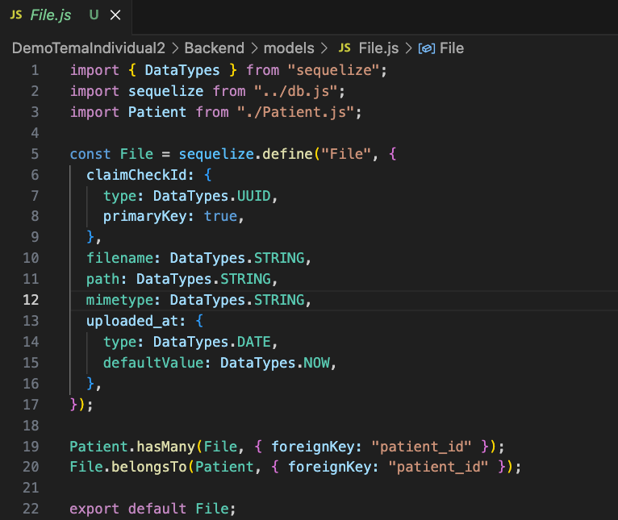
	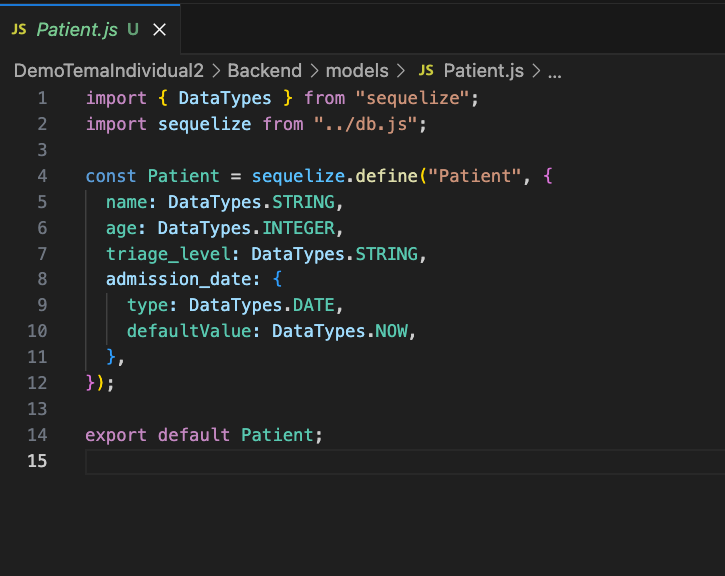
        
2. Definición de las API principales: 
    Se implementaron las rutas principales:
    
    - Una API para procesar la información ligera del paciente (nombre, edad, etc.).
    - Una API para procesar los archivos asociados.  
        Además, se creó una versión adicional que permite agregar archivos de manera individual.
	    
	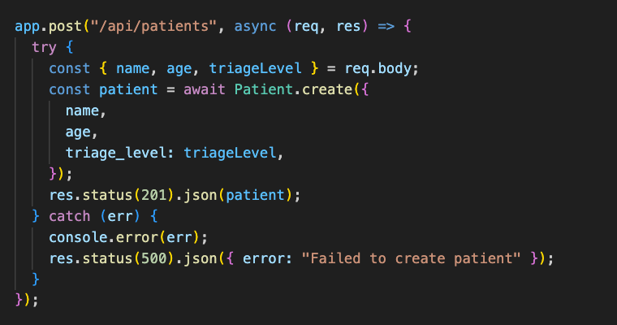
	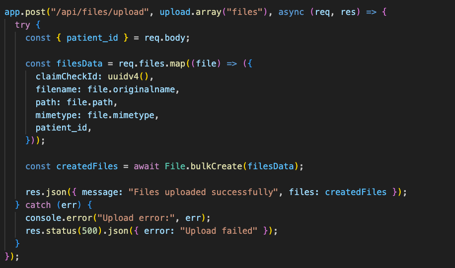

3. Generación del Claim Check:  
    En las API encargadas de recibir los archivos, se utilizó la librería UUID para generar identificadores únicos que sirven como claim check.  
    Cada archivo se guarda en un almacenamiento local (que simula un almacenamiento en la nube, como Amazon S3), y en la base de datos solo se guarda la referencia al archivo junto con su identificador y metadatos (nombre, ruta, fecha de carga). 

    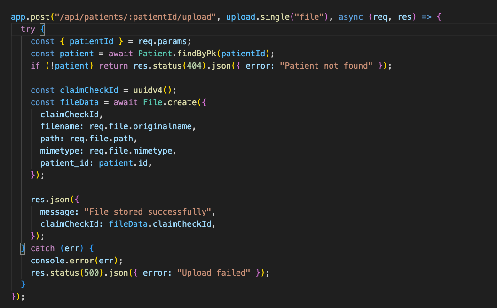
    
4. Creación de las API de recuperación de datos:  
    Se desarrolló una API para recuperar los archivos almacenados.  
    El servicio busca el archivo en el almacenamiento externo y, en caso de no encontrarlo, devuelve un mensaje de error.  
    Si se tratara de un almacenamiento en la nube, la verificación se haría consultando una URL externa.  
    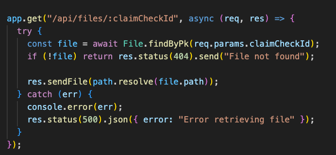
    
5. Pruebas y validación con Postman:  
    Se probaron las API principales con Postman para verificar que:
    - En la base de datos solo se almacena la referencia a los archivos.
    - En las solicitudes del cliente, no se envía el archivo completo, sino la referencia generada (Claim Check).
    
	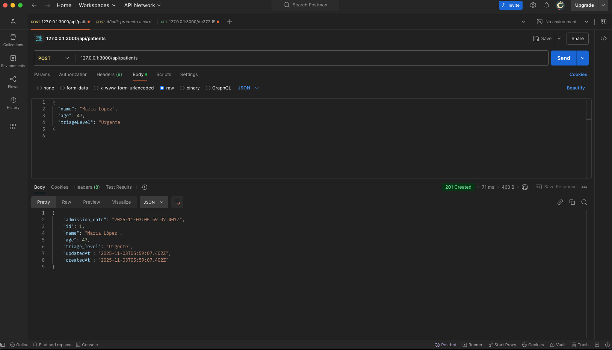
	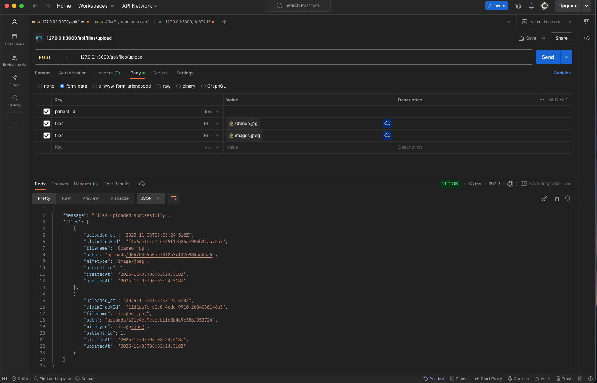
	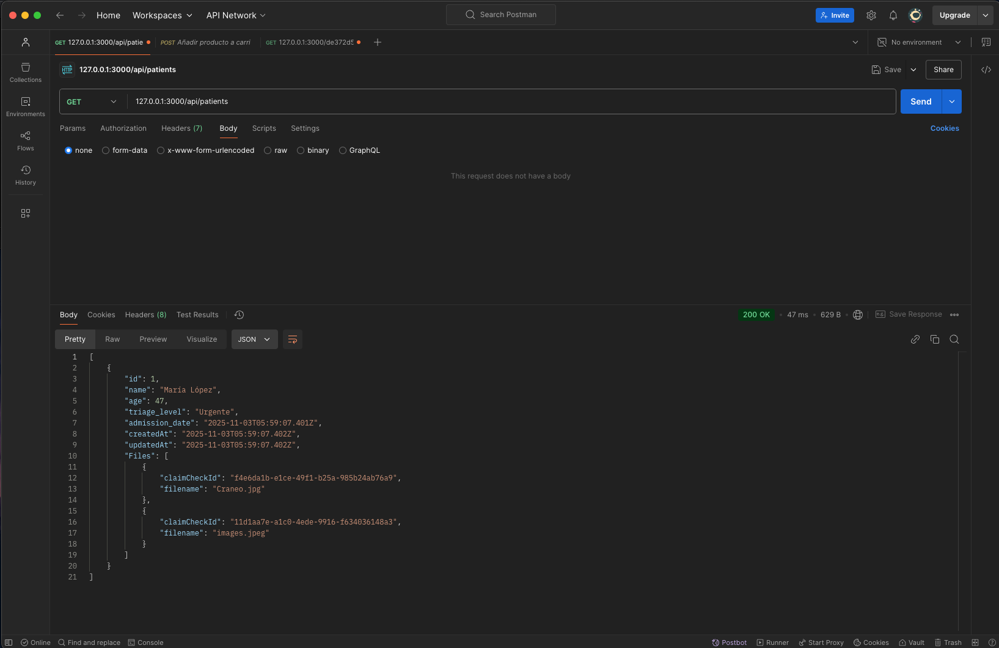
        
6. Implementación del Frontend para la Demo:  
    Se desarrolló una interfaz que incluye:
    - Una pantalla principal que muestra los pacientes registrados y sus datos.
    - Un modal para visualizar los archivos asociados a cada paciente y permitir subir nuevos archivos.
    - Un modal para registrar nuevos pacientes y adjuntar múltiples archivos en el mismo proceso.
---
#### **Demo**

En la demo final se puede observar cómo el sistema gestiona de forma eficiente los archivos asociados a los pacientes, reduciendo el tamaño del payload gracias al uso del patrón Claim Check. La arquitectura implementada permite simular el flujo de un sistema hospitalario de emergencia, demostrando cómo separar los datos pesados del cuerpo principal del mensaje mejora la eficiencia, escalabilidad y rendimiento del sistema.

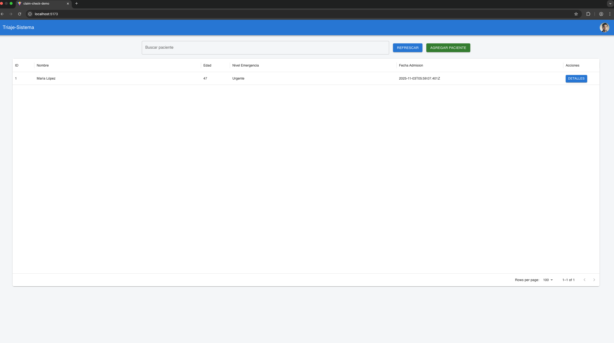
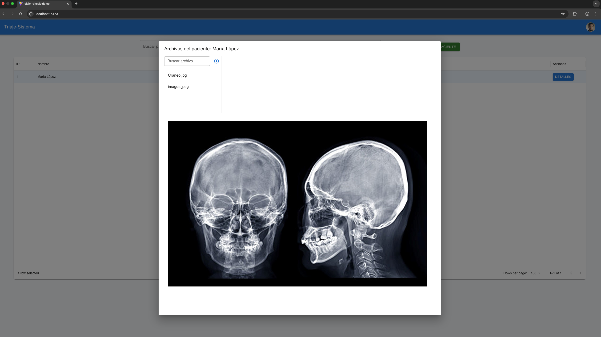
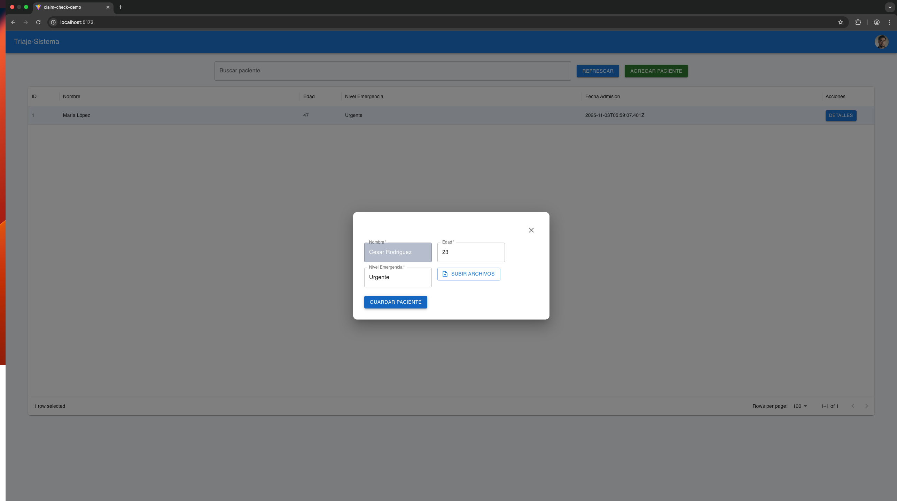
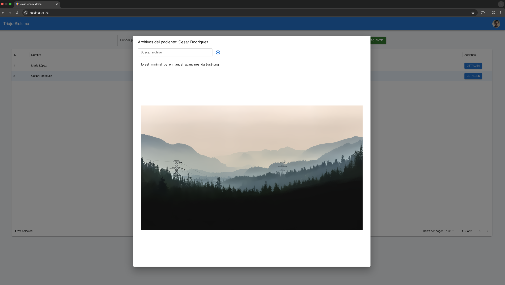

Codigo: [Repo_Individual](https://github.com/ulima-arqsoft/arqui252-rodriguez-ybarra.git)

[⬅️ Anterior](../0.7.1/0.7.1.md) | [🏠 Home](../../../README.md) | [Siguiente ➡️](../0.7.3/0.7.3.md)