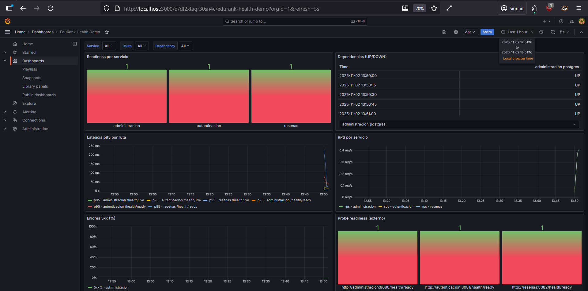

> [0. Acerca del Grupo](../../0.md) › [0.7. Trabajo Individual (Patrones Cloud)](../0.7.md) › [0.7.3. Integrante 3](0.7.3.md)

# 0.7.3. Integrante 3

#  Health Endpoint Monitoring — Diseño e Implementación (Edu Rank)

**Repositorio de la demo:** [https://github.com/ulima-arqsoft/arqui252-enriquez-leon/tree/main/edurank-health-demo](https://github.com/ulima-arqsoft/arqui252-enriquez-leon/tree/main/edurank-health-demo) 

---

## 1. Resumen

El patrón **Health Endpoint Monitoring** permite exponer el estado de salud de un servicio mediante endpoints HTTP para que orquestadores o balanceadores y herramientas como **Prometheus** y **Grafana** determinen si enviar trafico, alertar o accionar (reinicios, retirar de balanceo, etc)

En **Edu Rank** —arquitectura de microservicios (Auth, Reseñas, Administracion)— se implementan los endpoints

- `/health/live`
- `/health/ready`
- `/health/startup`
- `/metrics` (Prometheus)

El monitoreo se complementa con **Blackbox Exporter**, que valida la salud “desde afuera”, simulando la visión de un cliente externo

---

## 2. Desarrollo del Patrón

### 2.1 Problema

En sistemas distribuidos es común que

- Un proceso esté vivo pero no apto para recibir trafico (dependencias caidas, migraciones, calentamiento de cachés)  
- Las caidas sean parciales y no se detecten a tiempo (degradación silenciosa)  
- El balanceador envie trafico a instancias no listas generando errores o picos de latencia

**Necesidad:** un mecanismo fiable, estandar y automatizable para descubrir el estado real de cada microservicio y actuar en consecuencia

---

### 2.2 Solución (Patrón)

Exponer endpoints de salud con responsabilidades claras

| Endpoint | Propósito | Caracteristicas |
|-----------|------------|----------------|
| `/health/live` | Verifica que el proceso responda (sin I/O externo) | Reinicios automaticos si el proceso se cuelga |
| `/health/ready` | Verifica dependencias criticas (DB, cache, colas, claves) | 503 si falla alguna dependencia critica |
| `/health/startup` | Indica si el bootstrap terminó correctamente | Evita falsos positivos en arranque |
| `/metrics` | Expone métricas en formato Prometheus | Latencia, conteos, CPU/memoria, readiness |

**Integraciones**

- **Prometheus:** scrapea `/metrics` y sonda `/health/*`  
- **Grafana:** dashboards con estado, dependencias y latencias  
- **Alertmanager:** notifica ante fallas sostenidas (>2 minutos)

**Buenas practicas**

- `/live` rapido, sin dependencias externas  
- `/ready` con timeout corto y cache (TTL 2–5 s)  
- `/ready` y `/startup` no públicos  
- `/metrics` con baja cardinalidad en etiquetas

---

### 2.3 Casos de Aplicación (Industria)

- **Fintech / Pagos:** retirar nodos si fallan dependencias criticas (core-banking)  
- **E-commerce:** degradar el servicio si el buscador falla sin detener ventas  
- **SaaS multi-tenant:** aislar fallas de tenants especificos  
- **Medios/Streaming:** sondas externas para validar disponibilidad pública

---

## 3. Aplicación en el Proyecto Grupal (Edu Rank)

### 3.1 Arquitectura de Referencia

**Microservicios:** Auth, Administracion, reseñas, Ranking (futuro)  
**Dependencias criticas:** PostgreSQL (persistencia), Redis (cache)  
**Observabilidad:** Prometheus + Blackbox Exporter + Grafana  
**Gateway (futuro):** expone solo `/health/public` (basado en liveness)

---

### 3.2 Integración del Patrón

Cada servicio expone

- `GET /health/live` → reinicio si no responde  
- `GET /health/ready` → trafico solo si DB/Redis disponibles (503 si no)  
- `GET /health/startup` → controla el estado durante el arranque  
- `GET /metrics` → métricas: latencias, errores, readiness, dependencias

**Prometheus**
- Scrapea `/metrics` por servicio  
- Blackbox sondea `/health/ready` y `/health/live`

**Grafana**
- Paneles de:
  - Estado de Readiness por servicio (gauge)  
  - Dependencias (tabla service_dependency_up)  
  - Latencia p95 por ruta/servicio  
  - Error rate (% fallos)

**Alertas**
- `ServiceDown`: no scrapea  
- `ReadinessFailed`: readiness en 0 sostenido  
- `DependencyDown`: dependencia critica caida  

---

### 3.3 Valor que Aporta

- **Disponibilidad:** evita trafico a instancias no listas  
- **Resiliencia:** degradación controlada sin caida total  
- **Diagnóstico:** dashboards y alertas por dependencia  
- **Evolución:** base lista para probes nativos de Kubernetes

---

## 4. Desarrollo de la Demo

### Diseño de Endpoints

- `/health/live`, `/health/ready`, `/health/startup`, `/metrics`  
- Politica: `/ready` y `/startup` internos, `/live` público

### Métricas y Etiquetas

- Latencia por ruta/servicio (histogram)  
- Readiness (gauge 0/1)  
- Dependencias por servicio (gauge 0/1)  
- Tasas de error (calculadas en Prometheus)

### Monitoreo

- Prometheus: scrape_configs por microservicio  
- Blackbox Exporter: sondas HTTP externas  
- Alertas por caidas o readiness=0 sostenido

### Visualización

- Grafana: dashboards de readiness, dependencias, latencias p95 y error rate

### Validación

- **Fallas:** apagar Redis/Postgres → readiness=0 → alerta  
- **Arranque lento:** startup 503 → luego 200  
- **Degradación controlada:** dependencia no critica falla → modo degradado  
- En la practica el sistema reaccionó correctamente pero a veces tarda unos segundos en actualizar las métricas

---

## 5. Casos de Uso en Edu Rank

| Servicio | Escenario | Acción del Patrón |
|-----------|------------|-------------------|
| Autenticacion | Postgres cae | readiness=0 → Gateway evita logins |
| Administracion | Redis falla | modo degradado  |
| Reseñas | API externa falla | servicio sigue con datos internos |

---

## 6. Criterios de Aceptación

| Código | Descripción |
|--------|--------------|
| CA-01 | Cada servicio expone `/health/live`, `/health/ready`, `/metrics` |
| CA-02 | Readiness retorna 503 si falla dependencia critica (<1s) |
| CA-03 | Prometheus y Grafana visualizan readiness, dependencias, p95 |
| CA-04 | Alertas ante caida o fallas > 2 minutos |
| CA-05 | Documentación de runbooks por tipo de alerta |

---

## 7. Trade-offs y Riesgos

- Sobrecarga minima → mitigada con TTL/timeout  
- Riesgo de exposición interna → mitigado restringiendo endpoints  
- Cardinalidad de métricas → mitigado con etiquetas controladas  
- En algunos entornos la config de scrape puede dar warning si el hostname cambia

---

## Evidencia

[⬅️ Anterior](../0.7.2/0.7.2.md) | [🏠 Home](../../../README.md) | [Siguiente ➡️](../0.7.4/0.7.4.md)