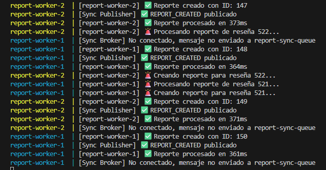

> [0. Acerca del Grupo](../../0.md) › [0.7. Trabajo Individual (Patrones Cloud)](../0.7.md) › [0.7.4. Integrante 4](0.7.4.md)

# 0.7.4. Integrante 4


## PATRÓN COMPETING CONSUMERS (CONSUMIDORES COMPETIDORES)

### PROBLEMA
El patrón Competing Consumers resuelve el cuello de botella que se genera cuando un único consumidor debe procesar múltiples mensajes o tareas de forma secuencial. Los principales problemas que aborda son:

- **Acumulación de mensajes**: la cola crece más rápido de lo que puede procesarse.
- **Latencia elevada**: tiempos de espera prolongados antes del procesamiento.
- **Subutilización de recursos**: un solo consumidor no aprovecha la capacidad disponible.
- **Falta de escalabilidad**: imposibilidad de ajustar la capacidad según la demanda.
- **Punto único de fallo**: si el consumidor falla, todo el procesamiento se detiene.

Adicionalmente, cuando algunos mensajes requieren más tiempo que otros, se bloquea el procesamiento de tareas más simples. También existe riesgo de pérdida de mensajes ante fallos y dificultad para responder a picos repentinos de carga.

### SOLUCIÓN
El patrón propone múltiples consumidores concurrentes que compiten por procesar mensajes de la misma cola, distribuyendo automáticamente la carga de trabajo entre todos los disponibles.

Los componentes clave son:

- **Cola de mensajes**: actúa como buffer y garantiza que cada mensaje sea procesado por un solo consumidor mediante mecanismos de bloqueo.
- **Grupo de consumidores**: instancias idénticas operando independientemente solicitando mensajes, procesándolos y confirmando su ejecución.
- **Mecanismo de distribución**: puede ser rotativo, basado en carga actual, por prioridad o aleatorio.

Tecnologías comunes incluyen Azure Service Bus, Amazon SQS, RabbitMQ, Apache Kafka y Google Cloud Pub/Sub.

A diferencia de otros patrones, Competing Consumers garantiza que cada mensaje sea procesado exactamente por un consumidor, mientras que en Publicación-Suscripción un mensaje llega a múltiples suscriptores. Su objetivo principal es distribuir eficientemente la carga de trabajo mediante escalabilidad horizontal.

### CASOS DE APLICACIÓN

#### Caso 1: Procesamiento de Pedidos en E-commerce
Plataformas como Amazon o MercadoLibre reciben miles de pedidos por minuto durante eventos especiales. Cuando un usuario completa una compra, múltiples consumidores compiten por validar inventario, procesar pagos, generar facturas, notificar a logística y enviar confirmaciones. Durante Black Friday, el sistema escala automáticamente de cincuenta a quinientos consumidores. Si algunos fallan, los demás continúan operando. El rendimiento aumenta de doscientos a más de diez mil pedidos por minuto, con confirmaciones en segundos en lugar de minutos.

#### Caso 2: Procesamiento de Imágenes en Redes Sociales
Instagram y TikTok procesan millones de fotos y videos diariamente que requieren generar miniaturas, detectar contenido inapropiado, extraer metadatos y optimizar para diferentes dispositivos. Consumidores especializados con GPU ejecutan modelos de inteligencia artificial, mientras otros optimizados para CPU generan miniaturas. El procesamiento paralelo reduce el tiempo de treinta segundos a tres segundos. Instagram procesa aproximadamente noventa y cinco millones de fotos diarias.

#### Caso 3: Sistema de Notificaciones Multicanal
Una startup SaaS envía notificaciones por correo electrónico, SMS, push, webhooks y dentro de la aplicación. Grupos especializados de consumidores manejan cada canal: veinte para email usando SendGrid, quince para SMS con Twilio, diez para notificaciones push mediante Firebase. Cada grupo respeta las limitaciones de velocidad de las APIs externas e implementa reintentos inteligentes. Un caso real mostró crecimiento de mil a quinientas mil notificaciones diarias con sesenta por ciento de reducción en costos versus servicios completamente administrados.

#### Caso 4: Análisis de Registros y Monitoreo
Empresas corporativas generan terabytes de registros diarios de servidores, microservicios, bases de datos e infraestructura de red. Los registros fluyen a Kafka donde consumidores compiten para analizar, normalizar, enriquecer con información adicional, agregar métricas, indexar en Elasticsearch y evaluar reglas de alertas. El procesamiento distribuido garantiza que los registros estén disponibles en menos de cinco segundos. Diferentes grupos de consumidores manejan políticas de retención escribiendo a almacenamiento caliente, tibio o frío según la antigüedad.

#### Caso 5: Procesamiento de Transacciones Bancarias
Bancos digitales procesan transferencias, pagos de servicios, depósitos y validación de fraude en tiempo real. La arquitectura usa colas con sesiones para garantizar orden por usuario, cien instancias de consumidores con sesiones persistentes, y monitoreo estricto. Los requisitos incluyen disponibilidad del noventa y nueve punto noventa y nueve por ciento, latencia menor a tres segundos en el percentil noventa y nueve, capacidad de cincuenta mil transacciones por minuto, y cumplimiento de estándares regulatorios como SOC 2 y PCI-DSS.

### Aplicación en su Proyecto Grupal

En nuestro proyecto, específicamente en el módulo de Reseñas y Calificaciones, integramos el patrón Competing Consumers para desacoplar y paralelizar el procesamiento de reportes de reseñas (Report Processor).

Objetivo práctico: evitar que la API que recibe reportes se convierta en un cuello de botella y permitir escalado horizontal de los workers que realizan validaciones asincrónicas sobre las reseñas reportadas.

Cómo aporta valor al sistema:

- Reduce la latencia percibida por el usuario (la API responde rápido tras encolar la tarea de procesamiento del reporte). 
- Permite escalar workers de forma independiente según la carga de reportes recibidos.
- Elimina el punto único de fallo: si un worker cae, otros continúan procesando la cola de reportes.
- Facilita el manejo de picos de reportes (colas actúan como buffer) y la observabilidad (métricas en RabbitMQ / logs de workers).

Mapeo concreto con la infraestructura de pruebas:

- Cola: `review-reports-queue` en RabbitMQ (workers broker).
- Workers: 2 instancias de `report-worker` compitiendo por mensajes.
- Cache: Redis para invalidar datos derivados cuando una reseña acumula suficientes reportes.
- Persistencia: PostgreSQL (Neon) para almacenar reseñas, calificaciones detalladas y reportes.

Validación y criterios de éxito en el proyecto:

- Latencia API: la API debe devolver respuesta inicial (aceptación del reporte) en < 200ms en condiciones normales.
- Throughput: los workers deben procesar 30 mensajes de report en los tests de integración.
- Distribución: los mensajes deben distribuirse entre los workers de forma balanceada (aproximadamente 15 por worker).
- Consistencia: las tablas en PostgreSQL deben persistir los reportes creados por los tests y el cache de Redis debe invalidarse cuando una reseña acumula ≥3 reportes.

Se validará con los scripts de prueba provistos en `tests/` y con las herramientas de observación: RabbitMQ Management UI, logs Docker y consultas SQL a PostgreSQL.

### Desarrollo de Código y Demo

Descripción del caso demo implementado en el repositorio de pruebas:

- Escenario: 50 reseñas creadas vía API (para poblar la BD), seguidas de 30 reportes que publican mensajes a `review-reports-queue` para ser procesados por múltiples workers compitiendo.
- Infraestructura mínima usada en la demo: RabbitMQ (workers broker), Redis, API principal y 2 instancias de report-worker (docker-compose los crea y levanta).

Archivos y artefactos relevantes:

- `docker-compose.yml` (levanta RabbitMQ, Redis, API y workers de prueba)
- `tests/01-seed-data.sql` – script SQL para poblar datos necesarios (usuarios, profesor, caches).
- `tests/02-create-reviews.js` – script que crea 50 reseñas mediante llamadas a la API (útil para poblar la BD para pruebas de reportes; no publica a colas).
- `tests/03-test-reports-competing.js` – script que crea 30 reportes y publica mensajes a `review-reports-queue`.


Pasos ejecutados para implementar la demo (paso a paso):

1. Preparar datos de prueba

	- Conectar a la base de datos PostgreSQL o adaptar a la base de datos correspondiente y ejecutar `tests/01-seed-data.sql` para crear usuarios, profesor y caches.

	Estas tablas reflejan la estructura mínima necesaria para que los scripts de prueba funcionen correctamente.

```sql
-- Usuarios en cache (según el script proporcionado)
CREATE TABLE IF NOT EXISTS usuarios_cache (
	id INTEGER PRIMARY KEY,
	nombre TEXT NOT NULL,
	fecha_sincronizacion TIMESTAMP WITH TIME ZONE DEFAULT now()
);

-- Profesores en cache (columnas: id, nombre, apellido, email, fecha_sincronizacion)
CREATE TABLE IF NOT EXISTS profesores_cache (
	id INTEGER PRIMARY KEY,
	nombre TEXT NOT NULL,
	apellido TEXT,
	email TEXT,
	fecha_sincronizacion TIMESTAMP WITH TIME ZONE DEFAULT now()
);

-- Cursos en cache (id, codigo, nombre, fecha_sincronizacion)
CREATE TABLE IF NOT EXISTS cursos_cache (
	id INTEGER PRIMARY KEY,
	codigo TEXT,
	nombre TEXT,
	fecha_sincronizacion TIMESTAMP WITH TIME ZONE DEFAULT now()
);

-- Categorías de calificación (nombres y flag activo)
CREATE TABLE IF NOT EXISTS categorias_calificacion_cache (
	id INTEGER PRIMARY KEY,
	nombre TEXT NOT NULL,
	activo BOOLEAN DEFAULT true,
	fecha_sincronizacion TIMESTAMP WITH TIME ZONE DEFAULT now()
);

-- Tipos de reporte
CREATE TABLE IF NOT EXISTS tipos_reporte_cache (
	id INTEGER PRIMARY KEY,
	nombre TEXT NOT NULL,
	fecha_sincronizacion TIMESTAMP WITH TIME ZONE DEFAULT now()
);


-- Tabla principal de reseñas
CREATE TABLE IF NOT EXISTS resenas (
	id SERIAL PRIMARY KEY,
	id_usuario INTEGER NOT NULL REFERENCES usuarios_cache(id),
	id_profesor INTEGER NOT NULL REFERENCES profesores_cache(id),
	id_curso INTEGER REFERENCES cursos_cache(id),
	texto TEXT,
	id_estado INTEGER REFERENCES estados_resena_cache(id),
	creado_at TIMESTAMP WITH TIME ZONE DEFAULT now()
);

-- Calificaciones detalladas por reseña (usar categorias_calificacion_cache)
CREATE TABLE IF NOT EXISTS calificaciones_detalladas (
	id SERIAL PRIMARY KEY,
	id_resena INTEGER NOT NULL REFERENCES resenas(id) ON DELETE CASCADE,
	id_categoria INTEGER NOT NULL REFERENCES categorias_calificacion_cache(id),
	puntaje NUMERIC(5,2) NOT NULL,
	creado_at TIMESTAMP WITH TIME ZONE DEFAULT now()
);

-- Reportes hechos por usuarios sobre reseñas
CREATE TABLE IF NOT EXISTS reportes (
	id SERIAL PRIMARY KEY,
	id_resena INTEGER NOT NULL REFERENCES resenas(id) ON DELETE CASCADE,
	id_usuario INTEGER NOT NULL REFERENCES usuarios_cache(id),
	id_tipo_reporte INTEGER NOT NULL REFERENCES tipos_reporte_cache(id),
	comentario TEXT,
	creado_at TIMESTAMP WITH TIME ZONE DEFAULT now()
);


```

Notas importantes:

- El script de pruebas asume que existen las tablas con los nombres exactos mostrados arriba (`categorias_calificacion_cache`, `tipos_reporte_cache`, etc.). Si su base de datos usa nombres diferentes, adapte el script o cree vistas/aliases.
- Asegúrese de que el profesor de prueba tenga `id = 1`, el curso `id = 1` y usuarios con ids en el rango 1..200 para mantener compatibilidad con los tests.


2. Levantar la infraestructura (desde la raíz del proyecto)

```cmd
docker-compose up -d
```

	- Esto inicia RabbitMQ (workers broker), Redis, la API y los workers de prueba (report-worker-1..2).

3. Verificar contenedores

```cmd
docker-compose ps
```

4. Instalar dependencias para los scripts de prueba (carpeta `tests`)

```cmd
cd tests
npm install
```

5. Ejecutar script de creación de reseñas (poblar BD)

```cmd
node tests/02-create-reviews.js
```

	- Nota: este script crea reseñas directamente vía la API para permitir probar el procesamiento de reportes posteriormente.

6. Ejecutar test de Report Processor (Competing Consumers)

```cmd
node tests/03-test-reports-competing.js
```

	- Monitorea procesamiento en:

```cmd
docker-compose logs -f report-worker-1 report-worker-2
```


Validación y métricas esperadas (resumen):

- Creación de reseñas: 50 reseñas creadas en la base de datos por `tests/02-create-reviews.js`.
- Report Processor (Competing Consumers): 30 mensajes publicados a `review-reports-queue`; distribución aproximada 15 por worker.


### Repositorio de Código Demo

Para copiar y ejecutar la implementación completa del patrón Competing Consumers en el procesamiento de reportes, accede al siguiente repositorio (excluyendo la configuración de base de datos, que debe adaptarse localmente):

[Repositorio Demo: Calificaciones y Reportes](https://github.com/ulima-arqsoft/arqui252-cabezas-diaz/tree/main/TrabajoIndividualDemoParte2/CalificacionesReportes)

---

### Verificación: captura de logs de workers

La siguiente imagen muestra una captura de los logs de los workers durante la ejecución de las pruebas (verifica que los `report-worker` procesan mensajes):



[⬅️ Anterior](../0.7.3/0.7.3.md) | [🏠 Home](../../../README.md) | [Siguiente ➡️](../0.7.5/0.7.5.md)