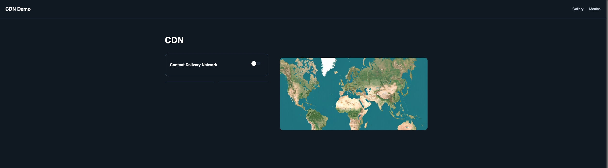
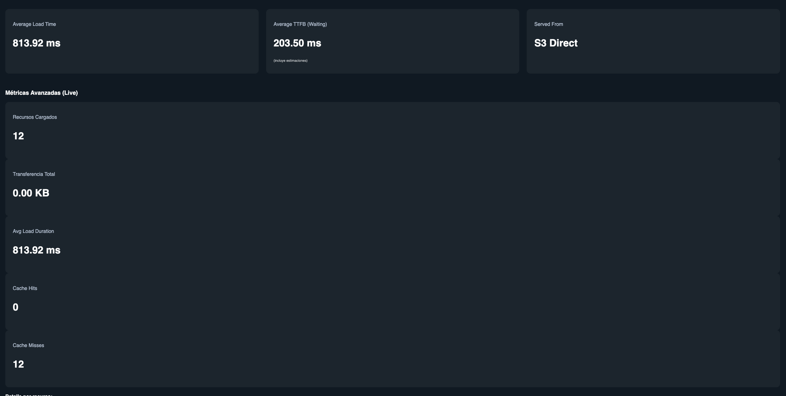

> [0. Acerca del Grupo](../../0.md) › [0.8. Temas Individuales (Parte 2)](../0.8.md) › [0.8.2. Integrante 2](0.8.2.md)

# 0.8.2. Integrante 2

Content Delivery Network (CDN): CloudFlare y S3 AWS

---
## Content Delivery Network (CDN)

Una Content Delivery Network (CDN) es una red distribuida de servidores que entrega contenido web a los usuarios de manera eficiente según su ubicación geográfica. El objetivo principal de una CDN es reducir la latencia, mejorar la velocidad de carga y garantizar la disponibilidad del contenido, especialmente en aplicaciones web con alto tráfico o distribución global.

### Funcionamiento básico

Cuando un usuario solicita un recurso (por ejemplo, una imagen o un archivo CSS/JS), la CDN lo entrega desde el servidor más cercano geográficamente, en lugar de desde el servidor de origen. Esto reduce los tiempos de respuesta y disminuye la carga sobre el servidor principal.

Ejemplo conceptual:

- Sin CDN: Un usuario en Tokio accede a un servidor en Nueva York → retrasos por distancia y congestión de red.
- Con CDN: El usuario en Tokio accede al contenido desde un nodo local en Asia → menor latencia y mayor velocidad.

### Beneficios del uso de una CDN

1. Reducción de latencia: El contenido se sirve desde nodos cercanos al usuario.
2. Alta disponibilidad: Distribución de contenido en múltiples servidores evita caídas por saturación o fallos locales.
3. Escalabilidad: Permite manejar picos de tráfico sin sobrecargar el servidor principal.
4. Seguridad: Muchas CDNs ofrecen mitigación de ataques DDoS y optimización de HTTPS.
5. Optimización de ancho de banda: El tráfico se reparte entre múltiples nodos, reduciendo costos de transferencia desde el servidor de origen.

### Ejemplos de uso

- Plataformas de streaming como Netflix o YouTube, donde millones de usuarios consumen contenido simultáneamente.
- Tiendas de e-commerce con clientes globales, para reducir el tiempo de carga de imágenes de productos.
- Aplicaciones web con alto tráfico estático, como blogs, portales de noticias o landing pages.

---

### Consideraciones técnicas

La implementación y comparación entre **S3 como servidor normal** y **Cloudflare como CDN** incluye los siguientes aspectos:

| Aspecto | Servidor Normal (S3) | Servidor con CDN (Cloudflare) |
|---------|---------------------|-------------------------------|
| **Ubicación de recursos** | Un único bucket en una región de AWS | Distribución global en múltiples nodos |
| **Tiempo de carga** | Depende de la distancia del usuario al bucket | Optimizado por nodo más cercano al usuario |
| **Gestión de tráfico** | Riesgo de saturación si hay picos de acceso | Distribuido automáticamente entre nodos, soporta picos grandes |
| **Seguridad** | Basada en políticas de S3 y permisos de acceso | Protección adicional: DDoS, WAF, SSL gestionado |
| **Costo de transferencia** | Basado en el tráfico que sale del bucket | Reducción del tráfico directo al origen, costo por cacheado |
| **Escalabilidad** | Limitada por la capacidad del bucket y la región | Escalable automáticamente con la red CDN |
| **Caching y optimización** | No disponible de forma nativa | Cacheo de contenido estático configurable (TTL, purgado, reglas) |

### Demo: Implementación de una CDN con Cloudflare y S3 AWS

Con el objetivo de demostrar la aplicación práctica de una Content Delivery Network (CDN), se realizó una implementación utilizando Amazon S3 como almacenamiento de archivos y Cloudflare como CDN. El entorno de pruebas se configuró sobre un proyecto frontend desarrollado en React, permitiendo comparar la carga de recursos directamente desde S3 versus a través de Cloudflare.

#### Configuración del entorno

El entorno de trabajo incluyó:

1. Amazon S3:
    
    - Se creó un bucket para almacenar archivos estáticos (imágenes y videos).
        
    - Se configuraron los permisos de lectura pública para que los archivos puedan ser accedidos desde el frontend.
        
    - Se habilitaron opcionalmente el versionado y los logs de acceso para monitoreo.
        
2. Cloudflare:
    
    - Se creó una cuenta gratuita en Cloudflare y se agregó el dominio utilizado en el proyecto.
        
    - Se configuró el DNS para apuntar al bucket de S3 a través de Cloudflare.
        
    - Se habilitó el cacheo de archivos estáticos con reglas de TTL, purgado de cache y SSL gestionado.
        
    - Se activaron medidas de seguridad adicionales (WAF, mitigación de DDoS).
        
3. Proyecto React:
    
    - Se desarrolló un frontend en React con dos páginas principales:
        
        1. Página de selección de fuente de recursos: permite elegir si los archivos se obtienen desde el bucket S3 directamente o mediante Cloudflare CDN.
            
        2. Página de visualización de recursos: carga imágenes y videos, mostrando métricas de carga como tiempo de respuesta y tamaño de transferencia.
            

---

#### Creación del código de prueba

El proyecto incluyó componentes React para simular la carga de recursos desde ambos métodos:

| Componente        | Función                                                | Métrica observada                          |
| ----------------- | ------------------------------------------------------ | ------------------------------------------ |
| `HomePage.jsx`    | Permite elegir la fuente de los archivos (S3 o CDN)    | Ninguna, interfaz de selección             |
| `ImageGrid.jsx`   | Muestra imágenes cargadas desde la fuente seleccionada | Tiempo de carga por imagen                 |
| `VideoGrid.jsx`   | Reproduce videos cargados desde la fuente seleccionada | Tiempo de buffer y tamaño de transferencia |
| `GalleryPage.jsx` | Presenta las métricas de carga y transferencia         | Latencia, ancho de banda consumido         |

**Ejemplo de código de selección de fuente:**

`const cdnEnabled = JSON.parse(localStorage.getItem("cdnEnabled")) || false;`

`function getMediaUrl(path, cdnEnabled) {`

  `const base = cdnEnabled ? CF_BASE_URL : S3_BASE_URL;`

  `return ${base}/${path};`

`}`

**Calculo de métricas:**

`const processedMetrics = mediaResources.map(entry => ({`

  `url: entry.name,`

  `fileName: entry.name.split("/").pop(),`

  `duration: Math.round(entry.duration),`

  `ttfb: Math.round(entry.responseStart - entry.requestStart),`

  `downloadTime: Math.round(entry.responseEnd - entry.responseStart),`

  `fromCache: entry.transferSize === 0 && entry.decodedBodySize > 0,`

  `servedFrom: entry.name.includes(CF_BASE_URL) ? "CloudFront CDN" : "S3 Direct"`

`}));`

---

### Resultados de la demo

Durante la demo, se cargaron varias imágenes y videos desde S3 directamente y desde Cloudflare CDN. Se registraron las métricas de tiempo de carga y transferencia de datos, observando los siguientes resultados:

- Carga desde S3: mayor latencia y tiempos de carga más altos para usuarios ubicados lejos de la región del bucket.
    
- Carga desde Cloudflare: tiempos de carga significativamente menores gracias al cacheo y distribución geográfica.
    

Se incluyeron capturas de pantalla y gráficos para visualizar la comparación de métricas:

---
#### Anexos
Todo el código de la demo fue publicado en el repositorio individual en GitHub, permitiendo a otros estudiantes revisar, ejecutar y experimentar con la táctica desarrollada.

**URL del repositorio:** https://github.com/ulima-arqsoft/arqui252-rodriguez-ybarra.git

**Video:** https://drive.google.com/file/d/1btfRI8cFnLQOGMAlFjeWu28Z0axMar70/view?usp=sharing

---

[⬅️ Anterior](../0.8.1/0.8.1.md) | [🏠 Home](../../../README.md) | [Siguiente ➡️](../0.8.3/0.8.3.md)