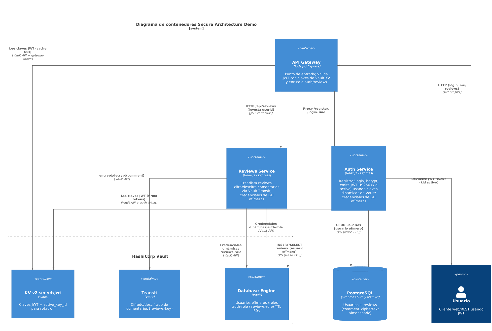
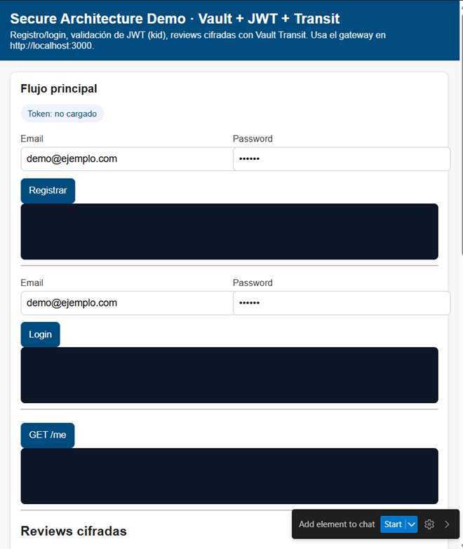

> [0. Acerca del Grupo](../../0.md) › [0.8. Temas Individuales (Parte 2)](../0.8.md) › [0.8.3. Integrante 3](0.8.3.md)

# 0.8.3 Integrante 3 - HashiCorp Vault en la demo

**Repositorio individual:** [Ver Resositorio de la demo](https://github.com/ulima-arqsoft/arqui252-enriquez-leon/tree/main/secure-architecture-demo)  
**Presentación en Canva:**  [Ver Canva](https://www.canva.com/design/DAG56YlBjhE/_FwiEOSLWeBpsPBL98b7sg/edit?utm_content=DAG56YlBjhE&utm_campaign=designshare&utm_medium=link2&utm_source=sharebutton)

**Video de la demo:** [Ver en Drive](https://drive.google.com/file/d/1j5wIr-bNUQREU2hSVThQBoT2vFFKRIXT/view?usp=drive_link)

---

## 1. Introducción general
La demo aborda la administración segura de secretos y operaciones de cifrado en arquitecturas modernas. En sistemas distribuidos los servicios requieren claves privadas, contraseñas, identidades temporales y funciones criptográficas que deben gestionarse de forma centralizada. El proyecto muestra cómo HashiCorp Vault reduce la exposición de secretos y aplica principios de seguridad Zero Trust.

---

## 2. ¿Qué es un Vault?
Un Vault es un sistema centralizado para almacenar, gestionar y controlar el acceso a secretos y claves criptográficas. Su objetivo es evitar que aplicaciones o usuarios manejen información sensible directamente y delegar estas operaciones a un servicio seguro y auditable. Un Vault debe autenticar, autorizar, ejecutar operaciones criptográficas y registrar cada acción.

**Características clave:**
- Autenticación robusta.
- Control de acceso granular basado en políticas.
- Motores especializados para manejo de claves y operaciones.
- Auditoría obligatoria de todas las solicitudes.
- Almacenamiento cifrado y seguro.
- Integración con sistemas distribuidos.

HashiCorp Vault es una de las implementaciones más completas de este concepto en entornos empresariales.

---

## 3. ¿Por qué HashiCorp Vault en esta demo?
Se eligió por criterios de seguridad, interoperabilidad y madurez. Vault ofrece funciones especializadas que no están integradas de forma nativa en alternativas simples como archivos .env o secretos embebidos en contenedores.

**Razones principales:**
- Múltiples modos de autenticación para ambientes heterogéneos.
- Motores criptográficos diseñados para tareas específicas (firma, cifrado transparente, etc.).
- Generación de credenciales dinámicas que eliminan usuarios estáticos en bases de datos.
- Amplia adopción y alineación con estándares de seguridad.
- Integración natural con microservicios sin acoplar lógicas críticas en código.
- Facilita rotación de claves y trazabilidad completa.

Vault promueve un modelo Zero Trust: nada es confiable por defecto y todas las operaciones se validan explícitamente.

---

## 4. Comparación con servicios similares
### 4.1 AWS Secrets Manager
- Ventajas: integración nativa con AWS, rotación automática.
- Limitaciones: menos flexible en motores criptográficos avanzados; menor capacidad para operar en entornos híbridos u on-premise.

### 4.2 Azure Key Vault
- Ventajas: integración con servicios de Microsoft, buen soporte para certificados.
- Limitaciones: limitado en credenciales dinámicas; dependiente de Azure.

### 4.3 Google Cloud KMS
- Ventajas: alto rendimiento para cifrado a gran escala.
- Limitaciones: políticas de acceso menos completas; no genera credenciales dinámicas ni tiene motores equivalentes al Database Engine.

### 4.4 HashiCorp Vault
- Funcionalidad más amplia: secretos, cifrado sin exponer claves, credenciales temporales, firma verificable de tokens, políticas avanzadas y auditoría completa.
- Independiente de proveedor cloud, aplicable en contenedores locales, entornos híbridos o multinube.

---

## 5. Motores de Vault usados en el proyecto
### 5.1 KV Engine v2
- Almacena y rota claves criptográficas como la clave privada para firmar JWT.
- Permite rotar sin afectar la operación; solo se expone la clave pública para validar tokens.

### 5.2 Transit Engine
- Cifra y descifra datos sin exponer la clave real (actúa como HSM lógico).
- Operaciones: cifrado, descifrado, firma y verificación.

### 5.3 Database Engine
- Genera usuarios temporales de base de datos con tiempo de vida limitado.
- Los microservicios no usan contraseñas fijas; al expirar el usuario se revoca el acceso.

---

## 6. Arquitectura general
Arquitectura basada en microservicios detrás de un API Gateway. Cada servicio evita manejar claves directamente y delega en Vault las operaciones sensibles.

**Principios aplicados:**
- Separación de responsabilidades.
- Minimización de secretos expuestos.
- Uso de credenciales efímeras.
- Cifrado gestionado externamente.
- Observabilidad mediante auditoría.

**Ventajas:**
- Menor riesgo de filtración de secretos.
- Aislamiento de fallos al evitar claves centralizadas en código.
- Escalabilidad sin replicar secretos.
- Control de acceso total mediante políticas.

---

## 7. Flujos conceptuales
### 7.1 Autenticación
- El servicio Auth delega la firma de tokens en Vault; recibe el token firmado sin conocer la clave privada.
- Obtiene un usuario temporal para acceder a su base de datos.

### 7.2 Cifrado
- El servicio Reviews envía texto a Vault para cifrado y almacena solo el texto cifrado.
- Para lectura, Vault descifra de forma controlada sin exponer claves.

---

## 8. Conclusión
Vault permite un plano de seguridad centralizado para microservicios, elimina la gestión manual de claves, evita secretos en código y proporciona trazabilidad total. Su diseño independiente de proveedor y motores especializados lo hacen adecuado para entornos académicos y empresariales. La demo muestra su aplicación práctica para proteger identidad, cifrado y acceso a datos con un enfoque moderno y alineado a mejores prácticas.

[⬅️ Anterior](../0.8.2/0.8.2.md) | [🏠 Home](../../../README.md) | [Siguiente ➡️](../0.8.4/0.8.4.md)

