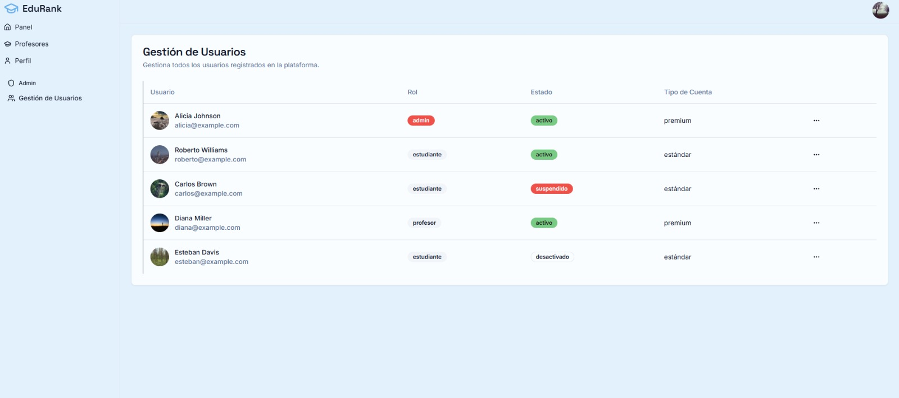

# 2.1.2. Módulo 2

### Módulo de Administración General

Este módulo se enfoca en las funcionalidades que usarán los administradores del sistema. Este rol tiene como fin mantener la correcta gestión de los datos base de la plataforma, tales como profesores, cursos, asignaciones y configuraciones generales necesarias para el funcionamiento global.

---

**RF01 - Gestión de profesores**

- **Descripción:** El sistema debe permitir a los administradores gestionar la información de los profesores registrados. Esto incluye crear nuevos profesores, modificar datos existentes, eliminar profesores y visualizar el listado completo.
    
- **Entradas:** Datos del profesor (nombre, apellido, correo institucional, código interno, departamento), ID del profesor.
    
- **Salidas:** Profesor creado, actualizado, eliminado o listado completo de profesores.
    
- **Restricciones:**
    
    - Solo administradores pueden acceder a esta funcionalidad.
        
    - No se permite eliminar profesores con cursos asignados.
        

---

**RF02 - Gestión de cursos**

- **Descripción:** El sistema debe permitir a los administradores gestionar los cursos de la plataforma. Esto incluye crear cursos, actualizar su información, eliminarlos y listar todos los cursos registrados.
    
- **Entradas:** Datos del curso (código, nombre, descripción, facultad/departamento), ID del curso.
    
- **Salidas:** Curso creado, actualizado, eliminado o listado completo de cursos.
    
- **Restricciones:**
    
    - Solo administradores pueden realizar esta acción.
        
    - No se permite eliminar cursos con profesores asignados o utilizados por otros módulos.
        

---

**RF03 - Asignación de profesores a cursos**

- **Descripción:** El sistema debe permitir a los administradores gestionar la relación entre profesores y cursos. Esto incluye asignar profesores a cursos, eliminar asignaciones existentes y consultar profesores por curso o cursos por profesor.
    
- **Entradas:** ID del profesor, ID del curso.
    
- **Salidas:** Asignación creada o eliminada; listado de profesores por curso o cursos por profesor.
    
- **Restricciones:**
    
    - Solo administradores pueden realizar estas operaciones.
        
    - No se permite registrar una asignación duplicada entre un profesor y un curso.
        

---

**RF04 - Configuración de categorías de calificación**

- **Descripción:** El sistema debe permitir a los administradores gestionar las categorías utilizadas para evaluar a los profesores al momento de realizar reseñas. Esto incluye crear nuevas categorías, editarlas o eliminarlas.
    
- **Entradas:** Nombre de la categoría, criterios asociados, ID de categoría.
    
- **Salidas:** Categoría creada, actualizada o eliminada.
    
- **Restricciones:** Solo administradores pueden realizar esta acción.
    

---

**RF05 - Gestión de tipos de cuenta**

- **Descripción:** El sistema debe permitir a los administradores gestionar los tipos de cuenta existentes en la plataforma y actualizar el tipo asignado a un usuario (por ejemplo, Estándar o Premium).
    
- **Entradas:** ID del usuario, nuevo tipo de cuenta.
    
- **Salidas:** Tipo de cuenta actualizado, mensaje de confirmación.
    
- **Restricciones:**
    
    - Solo administradores pueden realizar esta acción.
        
    - Aunque este microservicio gestiona la tabla Tipo_Cuenta, la actualización final debe coordinarse con el microservicio responsable de Usuarios.
        

---

**RF06 - Dashboard administrativo**

- **Descripción:** El sistema debe permitir a los administradores visualizar un panel con métricas globales relevantes. Aunque los datos provienen de distintos microservicios, la agregación, procesamiento y entrega del dashboard se realiza completamente dentro del microservicio de administración.
    
- **Entradas:** Solicitud de métricas.
    
- **Salidas:** Dashboard con estadísticas como: total de profesores, cursos, asignaciones, usuarios, reseñas, promedios de calificación y otros indicadores relevantes.
    
- **Restricciones:**
    
    - Solo administradores pueden acceder a esta funcionalidad.
        
    - En caso de fallos en otros microservicios, el sistema debe mostrar métricas parciales o vacías sin afectar la disponibilidad del dashboard.

---

