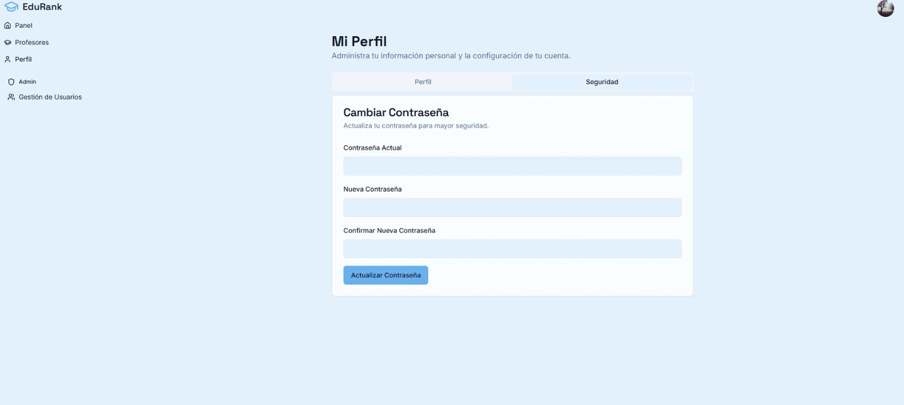
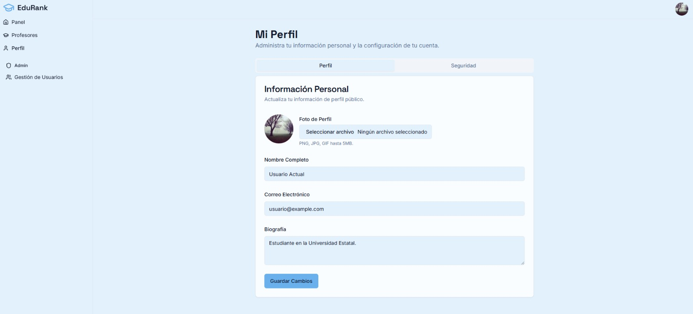

# 2.1.5. Módulo 5

### Módulo de Perfiles

Este módulo se enfoca en las funcionalidades que permitan a un usuario configurar y personalizar su cuenta.

---

**RF01 - Visualización de perfil**

- **Descripción:** El sistema debe permitir a los usuarios visualizar la información de su perfil personal.
    
- **Entradas:** ID del usuario.
    
- **Salidas:** Información del perfil (nombre, correo, foto, biografía, cursos relacionados, etc.).
    
- **Restricciones:** El usuario debe estar autenticado para acceder a su propio perfil; el acceso a perfiles de otros usuarios está limitado a la información pública.
    

---

**RF02 - Edición de información personal**

- **Descripción:** El sistema debe permitir a los usuarios actualizar la información personal de su perfil (nombre, correo, biografía, etc.).
    
- **Entradas:** ID del usuario, datos actualizados del perfil.
    
- **Salidas:** Perfil actualizado, mensaje de confirmación.
    
- **Restricciones:** El usuario debe estar autenticado; algunos campos sensibles (ejemplo: correo) pueden requerir validación adicional.
    

---

**RF03 - Configuración de privacidad**

- **Descripción:** El sistema debe permitir a los usuarios configurar la visibilidad de su información (por ejemplo, mostrar/ocultar foto, biografía o cursos asociados).
    
- **Entradas:** ID del usuario, configuración de privacidad seleccionada.
    
- **Salidas:** Perfil actualizado con las preferencias de privacidad.
    
- **Restricciones:** El usuario debe estar autenticado; las configuraciones aplican únicamente a su propio perfil.
    

---

**RF04 - Cambio de contraseña**

- **Descripción:** El sistema debe permitir a los usuarios cambiar su contraseña de acceso a la plataforma.
    
- **Entradas:** ID del usuario, contraseña actual, nueva contraseña.
    
- **Salidas:** Contraseña actualizada, mensaje de confirmación.
    
- **Restricciones:** El usuario debe estar autenticado; la nueva contraseña debe cumplir con los requisitos de seguridad establecidos.
    

---

 **RF05 - Actualización de foto de perfil**

- **Descripción:** El sistema debe permitir a los usuarios subir, cambiar o eliminar su foto de perfil.
    
- **Entradas:** ID del usuario, archivo de imagen.
    
- **Salidas:** Foto de perfil actualizada o eliminada, mensaje de confirmación.
    
- **Restricciones:** El usuario debe estar autenticado; las imágenes deben cumplir con el formato y tamaño máximo permitido.
    

---

**RF06 - Eliminación de cuenta**

- **Descripción:** El sistema debe permitir a los usuarios eliminar permanentemente su cuenta.
    
- **Entradas:** ID del usuario, confirmación de eliminación.
    
- **Salidas:** Cuenta eliminada, mensaje de confirmación.
    
- **Restricciones:** La acción es  irreversible; solo el propietario de la cuenta puede eliminarla.

---

