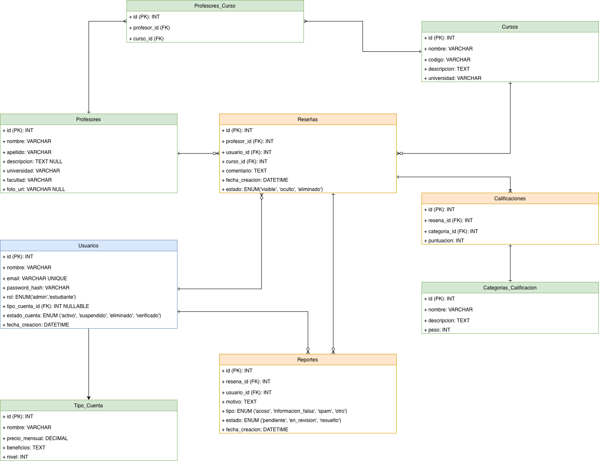

> [9. Metodología de Diseño de Arquitectura - Aplicación de ADD](../../9.md) › [9.3. Iteración 2: Identificar estructuras para soportar la funcionalidad primaria](../9.3.md) › [9.3.5. Vistas y Decisiones](9.3.5.md)

# 9.3.5. Vistas y Decisiones

El diagrama muestra el modelo de datos inicial de EduRank, reflejando la arquitectura de microservicios y la propiedad de cada tabla.

- **Verde**: Microservicio de Administración General (usuarios, categorías, métricas).
    
- **Naranja**: Microservicio de Reseñas y Calificaciones (reseñas y calificaciones de profesores).
    
- **Azul**: Microservicio de Autenticación y Seguridad (registro, login, 2FA, recuperación de contraseña).
    

Cada microservicio administra sus propias tablas, manteniendo independencia y escalabilidad. Las relaciones representan dependencias internas y referencias necesarias para coordinar datos entre servicios, garantizando autonomía y consistencia.

---

[⬅️ Anterior](../9.3.4/9.3.4.md) | [🏠 Home](../../../README.md) | [Siguiente ➡️](../9.3.6/9.3.6.md)